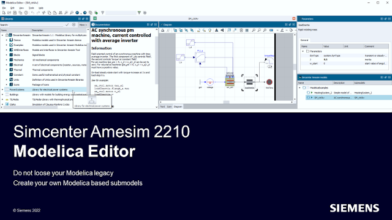
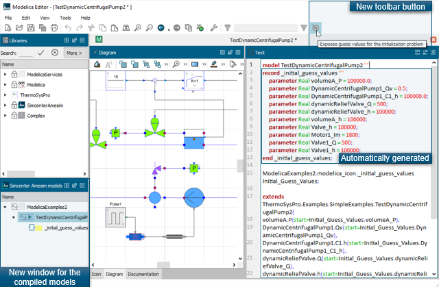

[Siemens Digital Industries Software](https://www.sw.siemens.com/ ) is proud to announce the recent release of [Simcenter Amesim 2210](https://www.plm.automation.siemens.com/global/en/products/simcenter/simcenter-amesim.html ), as part of its [system simulation solutions](https://www.youtube.com/watch?v=PNvEug8pcDM ). Among the key features introduced in this release, we can highlight the Modelica Editor related improvements below.

**Simcenter Amesim** offers a full-featured editor for the Modelica language that enables using and maintaining  Modelica legacy code and building your own Modelica-based models. Thus this complete integrated development application, the **Modelica Editor**, creates bridges between the **acausal** world of Modelica and the **causal** environment of Simcenter Amesim. 

#### Automatic generation of iteration variables and their guess values

As of Simcenter Amesim 2210, the **Modelica editor** provides a new toolbar button allowing to automatically generate the iteration variables of a selected model during compilation. As shown in the following figure, the iteration variables are defined in a <i> record </i> and automatically added to the model code to be reused directly from the Simcenter Amesim parameters panel.

#### Modelica Editor's new capabilities

The latest version of Modelica Editor contains other new features, the most important of which are:
* A new option now available in the Modelica preferences, enabling **parameter evaluation** as a means to reduce significantly the simulation time.
* A dedicated widget for your already-compiled models that are now seperated from your library tree, as shown in the figure above. 
* An easy update of your Modelica models directly in the Modelica Editor and a faster troubleshooting.
* An active tab now linked to its Modelica class highlighted in the library tree.
* Non-Latin (UTF-8) characters, like Asian characters, are now fully supported in Modelica descriptions and reflected without any changes once in Simcenter Amesim.

For more information on Simcenter Amesim, please visit our [website](https://www.plm.automation.siemens.com/global/fr/products/simcenter/simcenter-amesim.html).

