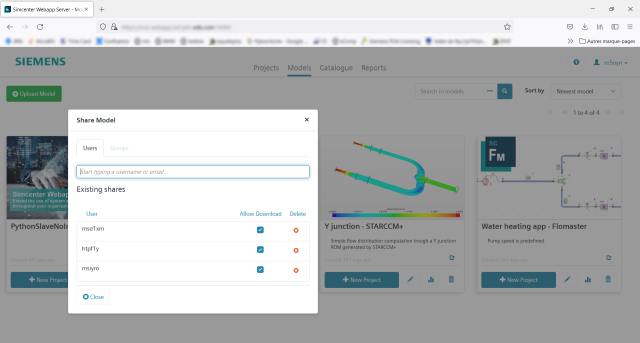
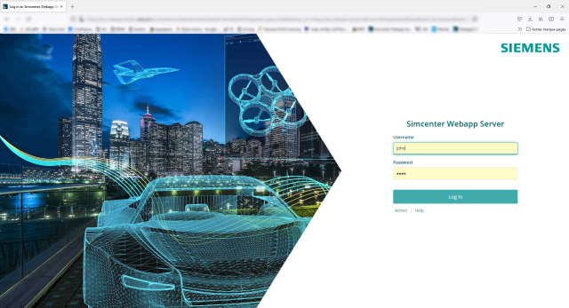
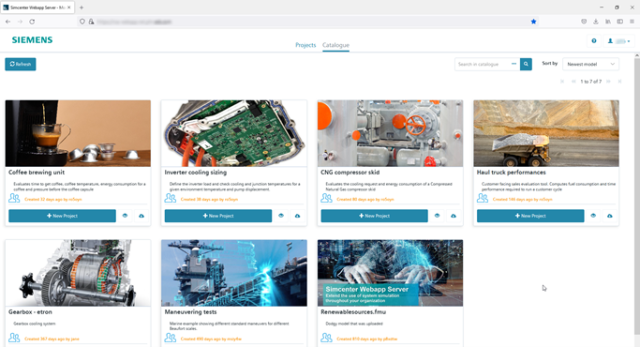
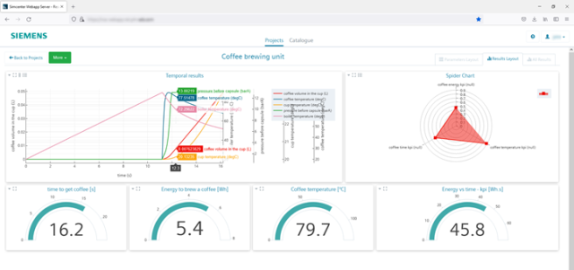

---
title: Spread your knowledge with FMU based engineering webapps for everyone
author: "Romain Gonard (Siemens Digital Industries Software)"
category: "vendor"
---	

Simcenter Webapp Server is a web-based tool that enables you to create engineering webapps in your company. As a model owner it’s an easy and safe way to spread your knowledge because you can grant the usage of this model through a customized webapp to anyone you give access. There are numerous applications where this can be of high value. Think for example about your presales/sales colleagues throughout the world who need tools for proof the performance of your products in front of their customers.  
Since release 2022.1 it is possible to create engineering webapps from a Functional Model Unit (FMU) created with other authoring tools such as: 
* Other system simulation tools like [Simcenter Flomaster](https://www.plm.automation.siemens.com/global/en/products/simcenter/flomaster.html )
* 3D simulation tools, such as [Simcenter Star-CCM+](https://www.plm.automation.siemens.com/global/en/products/simcenter/STAR-CCM.html )
* The [Simcenter ROM builder](https://www.plm.automation.siemens.com/global/en/products/simulation-test/rom-builder.html ) that creates an FMU based on your model or experimental results
* All third-party tools that can create a tool independent co-simulation FMU according to the FMI v2 standard.

## The value of knowledge is in accessibility 
The time and knowledge you’ve invested in creating your models is of high value, not everybody can do the same and many important decisions rely on them. Many of your colleagues or other connections would be glad to leverage your expertise even if they’re not an engineer themselves. With Simcenter Webapp Server you can spread your knowledge and support them with easy and safe access, which means: 
* No tool installation for end-users, the engineering webapps are available within a web browser.
* You can make sure that everyone is using the right version of the webapp and the FMU at any time, no versioning headache anymore. 
* It protects your IP. Since you centralize all simulations on a server there’s no direct access to model IP. 
* You control the permissions and can manage user access at every moment.

## How to create an engineering webapp from my models? 
The Simcenter Webapp Server is an easy to deploy and easy to use tool, the next few steps show how to create your engineering webapps.  

### Step 1
Login to the Simcenter Webapp Server through your web browser and by using your corporate credentials. 

### Step 2
Upload the FMU from your local computer to the Simcenter Webapp Server.

### Step 3
Design your engineering webapp by defining the parametrization layout and the result layout that the end user will see. This can combine temporal variable results, KPIs gauges, spider charts and more. 

### Step 4
Select who you want to share your webapp with, for example by using your corporate directory.

### Step 5
Done!

## How to use the engineering webapps?  
Now you’ve uploaded your models, designed the webapp and shared access to your end-users. Now you’ll see they quickly can start utilizing your work. In a few simple steps they can run the models and review their results in the way you prescribed: 

### Step 1
The end-users open the Simcenter Webapp Server in their web browser and by using (corporate) credentials. No software installation is needed and it runs on every PC but also mobile phones and tablets.  

### Step 2
In the Catalogue section, they select the engineering webapp that has been shared with them and create a new project. 

### Step 3
Once the webapp is opened, the end-users enter the parameters for the system configuration that needs to be evaluated and runs the simulation by a click on the green simulate button.

### Step 4
When the simulation is ready the results are automatically displayed in the way you have configured, tailored to its purpose and understandable for non-experts. 

### Step 5
Done! 

## Spreading your knowledge
Most likely your end-users and their audience will appreciate these new insights and realize the value of all efforts you put in the models, even if they might have never heard of concepts like CAE, physical modelling or FMU. You can spread your knowledge with FMU based engineering webapps for everyone, so they can further build on your expertise and take the discussion to a next level.  

For more information on Simcenter Amesim, please visit our [website](https://www.plm.automation.siemens.com/global/en/products/simcenter/simcenter-webapp-server.html ).
