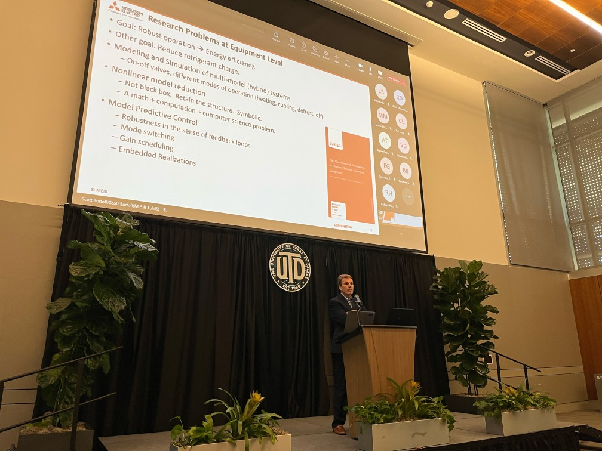
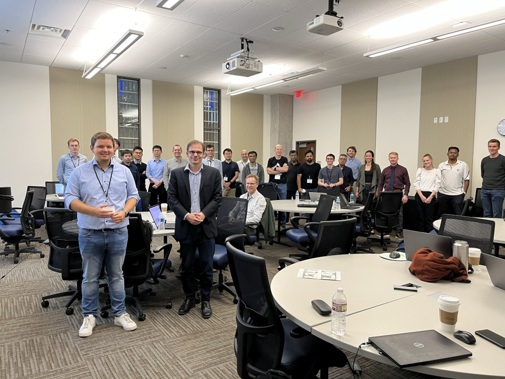
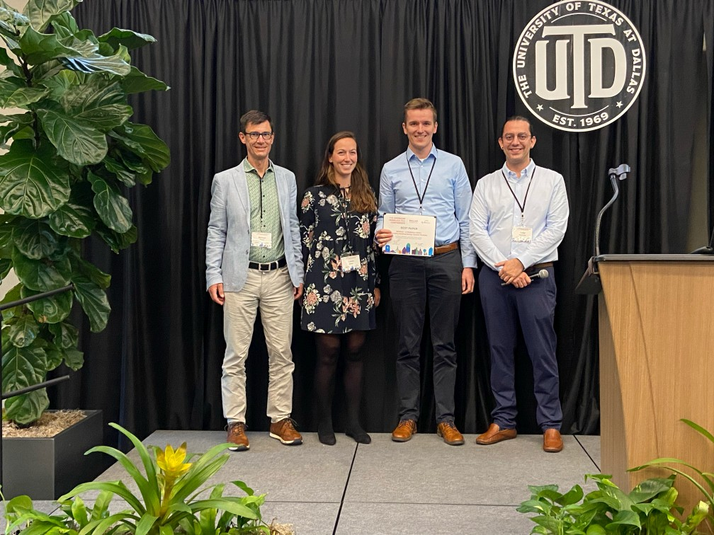

The American Modelica Conference 2022 was held in Richardson, Texas in October.
This was our first in-person event since COVID and from all appearances,
attendees thoroughly enjoyed the opportunity to get together and discuss their
work with Modelica. There were around 60 attendees for this year's event
presenting on a wide range of topics. There were also 42 virtual attendees who joined via the live stream.  The conference proceedings are available online [here](https://2022.american.conference.modelica.org/documents/NA_Modelica_2022_Proceedings.pdf 'American Modelica Conference 2022 Proceedings').

#### Keynotes

This year's keynote talks were given by Dr. Dirk Zimmer from DLR and
Dr. Scott Bortoff from MERL. Special thanks to Scott Bortoff for filling in at
the last minute!

#### Tutorials

Continuing one of the most cherished traditions of Modelica conferences, this in-person event provided a perfect opportunity to hold a total of [six tutorials](https://2022.american.conference.modelica.org/Workshops.html).

Of special mention, the tutorial from the DLR team on the [ThermoFluidStream Library](https://github.com/DLR-SR/ThermofluidStream/tree/tutorial), led by Dr. Dirk Zimmer and Niels Weber, attracted significant attention from conference attendees filling the classroom to capacity!

We would like to thank to all the teams that volunteered offering tutorials for their value contributions that ultimately help building the Modelica community in North America and hope they can continue to do it in future editions of the conference.

#### Special Thanks

Special thanks to this year's Platinum Sponsor, Ricardo Software (now Realis
Simulation) as well as to our Gold Sponsors, Dassault Systèmes, Modelon,
JuliaHub, Wolfram, Ansys and our Silver Sponsor, Maplesoft.

We'd also like to thank Professor Yaoyu Li (University of Texas at Dallas) for
all his hard work in providing us with an excellent venue for this year's event
and his students for helping with the execution of the event.

 

#### Congratulations

* **Best Paper**: Congratulations to Fabian Wüllhorst, Laura Maier, David Jansen, Larissa Kühn,
Dominik Hering, and Dirk Müller for winning the "Best Paper" award for their
paper, _"BESMOD – A Modelica Library for Providing Building Energy System
Modules"_.
* **First Runner Up**: This award went to Jiacheng Ma, Donghun Kim and
James E. Braun for their paper, _"Transient Simulation of an Air-source Heat
Pump under Cycling of Frosting and Reverse-cycle Defrosting"_.
* **Second Runner Up**: This award went to Hongtao Qiao and Christopher Laughman for their
paper, _"Performance Enhancements for Zero-Flow Simulation of Vapor Compression
Cycles"_.

These awards were given based on ratings given by reviewers during
the peer review process. We would like to thank the reviewers for their thorough
and constructive reviews that were essential in upholding the high quality of
the published papers that Modelica conferences are known for. The conference
board hopes to continue these paper awards in future conferences, for which we
will need the continued support of the Modelica community in reviewing papers.

### Future Events

With this event over, we must look now to planning future events. If anyone is
interested in hosting the next American Modelica Conference, please [contact
us](mailto:board@na.modelica-users.org). We look forward to seeing you all again
in the future.
