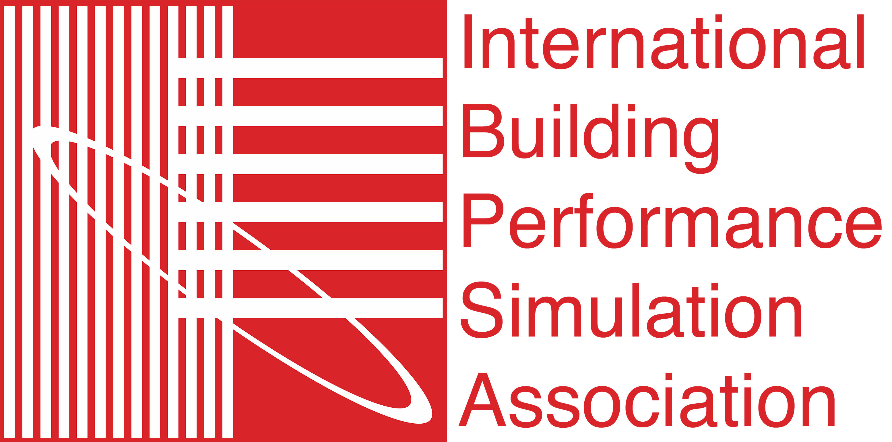

{:width="250px"}

The [International Building Performance Simulation Association (IBPSA)](http://www.ibpsa.org/) approved on January 25, 2023, the
formation of the *IBPSA Modelica Working Group*.
The IBPSA Modelica Working Group will further develop the Modelica IBPSA Library,
a library that originated from the [International Energy Agency (IEA) Annex 60](https://https://www.iea-annex60.org/)
and the subsequent [IBPSA Project 1](https://ibpsa.github.io/project1/).
The group will meet monthly to coordinate the development of the library.

The library is used as the core of the following Modelica library:

 - AixLib, from RWTH Aachen University, Germany, (https://github.com/RWTH-EBC/AixLib),
 - Buildings, from LBNL, Berkeley, CA, USA, (http://simulationresearch.lbl.gov/modelica),
 - BuildingSystems, from UdK Berlin, Germany, (http://www.modelica-buildingsystems.de/), and
 - IDEAS, from KU Leuven, Belgium, (https://github.com/open-ideas/IDEAS).

These libraries extend the Modelica IBPSA Library and user support is typically provided through
the distributions of the above libraries.

A further purpose of the group is to
coordinate the needs of the IBPSA community with the Modelica Association and
with Modelica modeling and simulation environment developers.

Participation in the working group is open to anyone who intends to contribute.
See the
[meeting schedule](https://github.com/ibpsa/modelica-working-group/wiki/Meetings) for upcoming meetings,
and see the [approved proposal](https://github.com/ibpsa/modelica-working-group/blob/main/reports/2023-proposal-approved/build/latex/ibpsa_modelica.pdf)
for further details.
