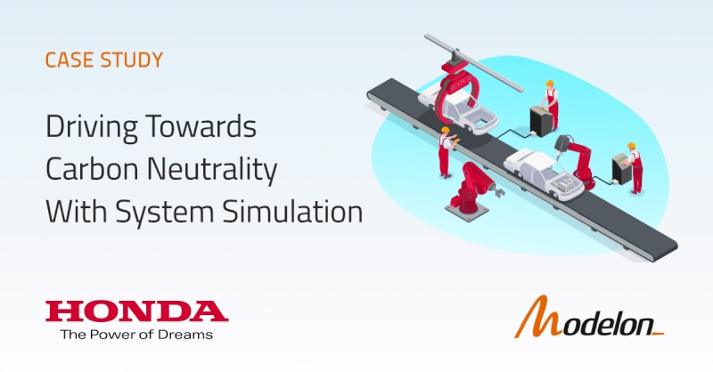
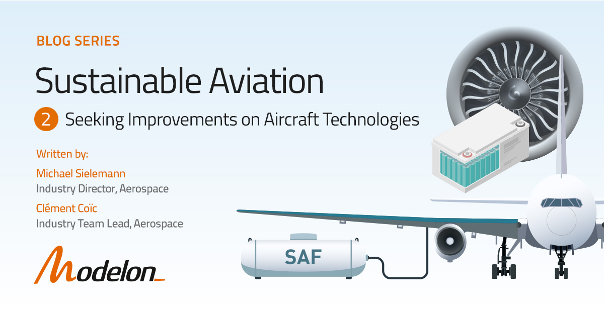

#### Modelon Resource: Driving Towards Carbon Neutrality With System Simulation
 

 
As part of Honda's mission to become carbon neutral by 2050, their engineering team was tasked with assessing a variety of carbon reduction options on an existing production plant to make strategic system design and cost-effective decisions. [Read more here](https://modelon.com/support/becoming-carbon-neutral-with-system-simulation-honda/). 

#### Modelon Blog: 2023 Sustainable Aircraft Technology and Trends

With current trends in the aerospace industry, we're getting closer to more sustainable aviation. In this blog, we look at emerging trends like SAF, ultra-high bypass ratio geared turbofan, and partially electric (“hybrid”) propulsion. [Read more here](https://modelon.com/blog/aircraft-technology-trends-improvements-2023/). 

#### Knowledge Pages 

Visit the new [HVAC&R page](https://modelon.com/industries/hvac-and-refrigeration-system-simulation-solution/) and [Modelon Services page](https://modelon.com/services/) to learn more about HVAC&R simulation applications and ways Modelon can help speed up your engineering design process. 

