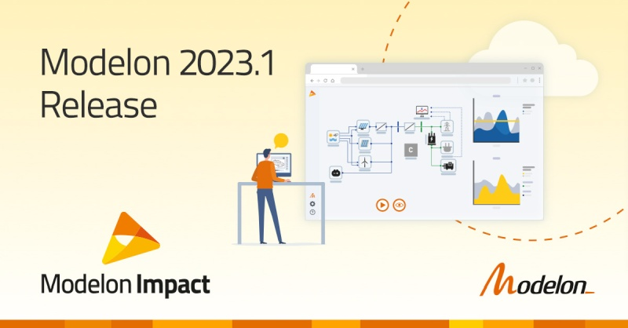

#### Modelon 2023.1 release

 
The Modelon 2023.1 Release contains support for FMU cross-compilation to Windows, improved diagnostics, updated libraries, and more! Check out the details in the [Modelon Help Center](https://help.modelon.com/latest/release_notes/impact_2023_1/). 

#### Video Testimonials 
 
 

The Modelon team has conducted videos with customers detailing why they chose Modelon, their use cases, and how their experience has been working with Modelon Impact. [Watch the videos here](https://modelon.com/support-learning/resources/?_resource_type=testimonial). 

#### Upcoming Events

 
Visit Modelon teams onsite at The Distributed Energy Show in Telford and World Smart Energy Week in Tokyo! For more event information, [click here](https://modelon.com/company/events/). 