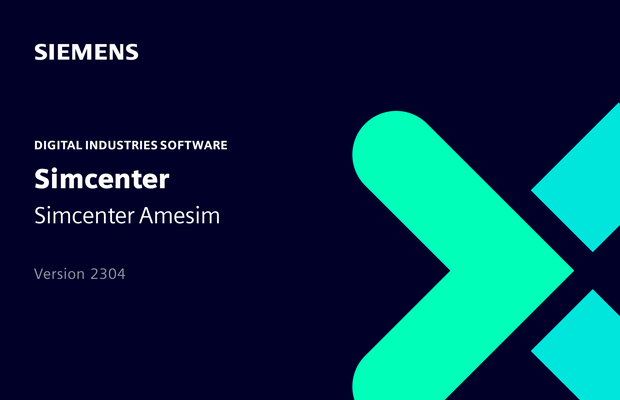

[Siemens Digital Industries Software](https://www.sw.siemens.com/ ) is pleased to announce that Simcenter Amesim 2304 is expected to be released on April 28, 2023, as part of its system simulation solutions. 
This release will be the first to introduce the export of FMUs for co-simulation, complying with version 3.0 of the FMI specification.

## Introducing 3.0 FMUs for co-simulation
With Simcenter Amesim 2304, users will be able to export their models as 3.0 FMUs for co-simulation. 
As before, in addition to native Simcenter Amesim components, models can be hybridized with Modelica blocks, pretrained neural networks, Statecharts or previously imported Simulink models. 
The following 3.0 specific features will be supported:
* [“FMI terminals”](https://fmi-standard.org/docs/3.0/#fmiTerminalsAndIcons ), with the following [example](https://newsletter.modelica.org/2021-03/index#fmi-physical-terminals-between-simcenter-amesim-and-simcenter-flomaster ) of concrete application.
* [“Build configurations”](https://fmi-standard.org/docs/3.0/#BuildConfiguration ), to automate the handling of the FMUs specifically generated for the real-time targets supported by Simcenter Amesim. 

All capabilities that were previously supported by 2.0 FMUs will still be available with 3.0 FMUs, notably the recently introduced Windows to Linux cross-compilation, as already presented [here](https://newsletter.modelica.org/2022-03/amesim_details.html ).

Stay tuned! 
For more information on Simcenter Amesim, please visit our [website](https://www.plm.automation.siemens.com/global/en/products/simcenter/simcenter-amesim.html ).
