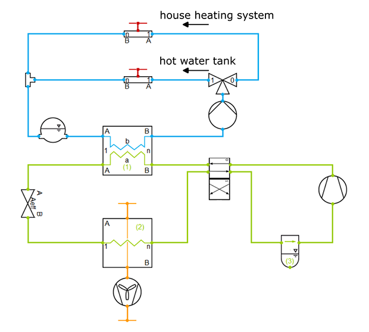

TIL Suite is suitable for the stationary and transient simulation of all types of thermodynamic systems. Thanks to the fast calculation of thermophysical properties (TILMedia) and many other numerical optimizations, complex thermal systems such as reversible heat pump systems can be dynamically simulated.

The next release TIL Suite 3.14.0 in April 2023 features a typical air-water heat pump example with propane as the refrigerant. It includes a plate heat exchanger as condenser, which can heat water either for the house heating system or the hot water tank, shown as the two blue circuits with the three-way valve for switching. On the low-pressure side of the green refrigerant circuit is a fin-and-tube evaporator. The moisture of the ambient air flow (orange) through the evaporator can condense and freeze at low temperatures. Due to a partial blockage of the air-side heat exchanger by frost and ice, the system efficiency / COP (coefficient of performance) will decrease. By reversing the refrigerant flow using a four-way valve the evaporator is defrosted.

With such a TIL Suite model, it is possible to

 - conduct parameter studies e.g., using [MoBA Automation](https://www.tlk-thermo.com/index.php/en/software/moba-automation)
 - analyse the system behaviour e.g., using thermo-dynamic visualization in [DaVE](https://www.tlk-thermo.com/index.php/en/software/dave)
 - optimize control strategies and parameters e.g., using [Optimization Suite](https://www.tlk-thermo.com/index.php/en/software/optimization-suite)

For further information visit [www.tlk-thermo.com](https://www.tlk-thermo.com/index.php/en/til-suite) or contact us at [til@tlk-thermo.com](mailto:til@tlk-thermo.com).
