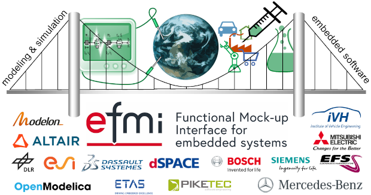
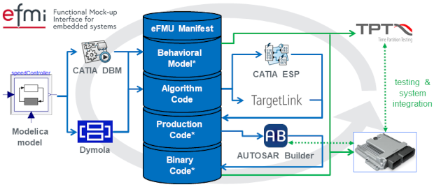

{:width="620px"}

#### MAP eFMI Website Launched

The [official website](https://www.efmi-standard.org/) of the Modelica Association project _Functional Mock-up Interface for embedded systems_ (MAP eFMI) is finally on air. Besides drafts of the upcoming standard, it provides a good overview of the eFMI technology, motivation, available tooling, documentation and introductory material, example eFMUs and a project organization overview.

The project now also provides a new public mailing list, `efmi-info@googlegroups.com`, to help newcomers to get in contact with us and started with eFMI.

#### First Commercial Tool Releases

The first commercial tools with support for eFMI are officially released and available on the market. Most are already well-known and established tooling in the physics modeling or embedded software domain, giving professionals a chance to plug-and-play with eFMI. Together, the now available commercial tooling covers the complete eFMI workflow from physics modeling in Modelica down to production code on dedicated embedded platforms. The interoperability has been extensively tested using the [cross-check test suite provided by MAP eFMI](https://github.com/modelica/efmi-testcases). 

The now available tools, and their interaction along the eFMI workflow, are summarized in the following figure:

{:width="620px"}

The newly released eFMI tools are (in alphabetic order):

 - **AUTOSAR Builder** by [Dassault Systèmes](https://www.3ds.com/): IDE for modeling, testing and validation of in-vehicle embedded systems for the [AUTOSAR Classic and Adaptive Platforms](https://www.autosar.org/), facilitating seamless integration with other AUTOSAR compliant tools based on the [AUTOSAR Tool Platform (Artop)](https://www.artop.org/). Enables the application of eFMI Production Code containers in AUTOSAR environments.

 - **CATIA ESP** by [Dassault Systèmes](https://www.3ds.com/): Embedded source code producer (ESP) on the [3DEXPERIENCE® platform](https://www.3ds.com/3dexperience), enabling the generation of eFMI Production Code containers with safety-critical, realtime capable, [MISRA C:2012](https://www.misra.org.uk/) conforming C code from eFMI Algorithm Code containers.

 - **Dymola** by [Dassault Systèmes](https://www.3ds.com/): Modelica IDE for the acausal, equation-based modeling and simulation of complex multi-domain physics. Enables the generation of eFMI Algorithm Code containers (i.e., causal/algorithmic solutions) from acausal controller and virtual sensor models in Modelica.

 - **TargetLink** by [dSPACE](https://www.dspace.com/): Production code generator for highly efficient C code straight from MathWorks® [Simulink®](https://www.mathworks.com/products/simulink.html)/[Stateflow®](https://www.mathworks.com/products/stateflow.html) models, supporting early verification through built-in simulation and testing, certified for ISO 26262, ISO 25119 and IEC 61508, and with support for the [AUTOSAR Classic and Adaptive Platforms](https://www.autosar.org/). Enables the generation of eFMI Production Code containers with safety-critical, realtime capable, [MISRA C:2012](https://www.misra.org.uk/) conforming C code from eFMI Algorithm Code containers.

 - **TPT** by [PikeTec](https://piketec.com/): IDE for testing ECU software and embedded control systems in all development phases such as model-in-the-loop (MiL testing), software-in-the-loop (SiL testing), processor-in-the-loop (PiL testing), hardware-in-the-loop (HiL testing), ECU testing and vehicle testing, supporting relevant safety standards, such as ISO 26262, and test assessment, reporting, management and requirements traceability. Enables the testing of eFMI Production Code containers with eFMI Behavioral Model containers in many well-known embedded execution environments.

#### MAP eFMI Tool Releases

MAP eFMI released two supporting open source tools for packaging and accessing eFMUs and their individual containers and for checking eFMUs for conformance with the _eFMI Standard_: the [eFMI Container Manager](https://github.com/modelica/efmi-containermanager) and the [eFMI Compliance Checker](https://github.com/modelica/efmi-compliancechecker).

#### eFMI Tutorial at the 15th International Modelica Conference 2023

An introductory tutorial of eFMI tooling will be provided at the upcoming [15th International Modelica Conference 2023](https://2023.international.conference.modelica.org/). The tutorial will cover the whole eFMI workflow with a running example and give participants a hands-on chance to try eFMI integration in [Dymola](https://www.dymola.com), [CATIA ESP](https://www.3ds.com/products-services/catia/), [TargetLink](https://www.dspace.com/en/pub/home/products/sw/pcgs/targetlink.cfm), [AUTOSAR Builder](https://www.3ds.com/products-services/catia/products/autosar-builder/) and [TPT](https://piketec.com/tpt/) themselves.

#### New Project Members

Since its kickoff in 2021 with eleven founding members, four new organizations joined MAP eFMI (in alphabetic order): [Altair Engineering Inc.](https://altair.com/), [Institute of Vehicle Engineering CO LTD](http://www.ivh.co.kr/), [Mercedes-Benz AG](https://www.mercedes-benz.com/) and [Mitsubishi Electric Research Laboratories](https://www.merl.com/).

The project is open for further membership applications. If you think your organization should be part of standardizing and leveraging on the _physics modeling to embedded software bridge_ of the Modelica Association, please check our [membership application guidelines](https://www.efmi-standard.org/media/resources/MAP-eFMI-application.pdf).

**In any case, [check the new eFMI website](https://efmi-standard.org) or contact us on our new public mailing list `efmi-info@googlegroups.com`!**
