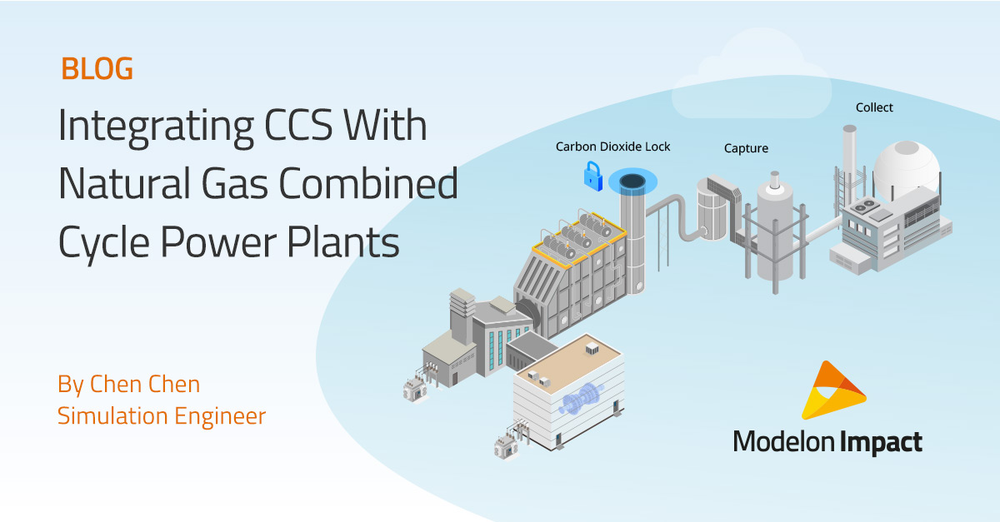

Modelon is revolutionizing the engineering design industry by offering technologies and services that enable customers to leverage system simulation. Modelon’s flagship product, [Modelon Impact](https://modelon.com/modelon-impact/), is a cloud system simulation platform that helps engineers virtually design, analyze, and simulate physical systems.

Visit [https://modelon.com](https://modelon.com/) for more information or follow on [LinkedIn.](https://www.linkedin.com/company/modelon)

#### Modelon Library Updates 

As part of Modelon’s 2023.2 release, Modelon has made significant updates to its set Modelica libraries. The highlights below correspond to individual [Modelica libraries](https://modelon.com/modelon-library-suite-modelica-libraries/) that Modelon offers as part of Modelon Impact.  

##### Thermal Power Library

- **One-factor Scaling of Combined Cycle Plant Models** Users will now be able to adapt the size of their combined cycle plant models within a single parameter. Because every plant is unique, this capability eliminates the need for system modelers to recreate a system model. A user can simply manipulate the size of a pre-existing system model while ensuring that the resized plant matches important variables such as the temperature and pressure of the relevant plant. In turn, users are able to get relatively accurate answers within minutes. 

- **Hydrogen Blending of a Combined Cycle Gas Turbines** This capability allows you to replace natural gas with hydrogen gas in a combined cycle gas turbine. This is especially useful for users who’d like to evaluate design architectures such as controls design and heat recovery steam generator design with the integration of hydrogen fuel. Performance studies and carbon dioxide reduction studies are also possible with this capability. 

- **Integrated Carbon Capture Plant with Combined Cycle Plant Model** This model includes a carbon capture plant and combined cycle plant integrated together. This integrated approach allows for complete optimization and flexibility of plants that are designed accordingly.  

##### Vapor Cycle Library

- **Air-to-Air Source Heat Pump Model** An air-to-air heat pump model is now available as part of the Vapor Cycle Library. This allows users to model and simulate applications related to the design and operation of residential heat pumps.  

- **Stacking with Fin-on-Tube Heat Exchanger** The existing fin-on-tube heat exchanger model within the Vapor Cycle Library has been improved to allow stacking and multi-circuit modeling. This is particularly useful for users using Modelon Impact for HVAC applications.  

- **Hydrogen Storage Tank Model Package for Aircraft** Modelon offers a pre-built hydrogen storage tank model in Vapor Cycle Library for hydrogen aircraft applications. This package includes a subpackage dedicated for tank sizing, which uses methodologies that take into consideration mechanical strength, structural design, heat transfer and dormancy. This package also includes example models that use the hydrogen tank for dynamic simulation. These example models comprise of a detailed tank filling experiment, a sealed tank experiment, and an evaporation of liquid cryogenic hydrogen experiment with a heat exchanger. 

##### Air Conditioning Library

- **Automatic Summation of Refrigerant Volumes and Mass** A new capability to automatically sum refrigerant volumes and masses has been introduced.  This fully automatic capability streamlines the process for running fixed charge simulations and monitoring charge in the system. 

- **Non-Ideal Sensors** A package of non-ideal sensor models is now included with the library to support model-based controls development.  The non-ideal sensors can flexibly add sensor dynamics, failure, and analog-to-digital conversion effects to sensor outputs to more accurately mimic real sensor signals.  An example experiment showing the various non-ideal effects is also included. 

##### Vehicle Dynamics Library 

- **Support for rFpro HD TERRAIN SERVER** Modelon’s Vehicle Dynamics Library now supports rFpro’s TERRAIN SERVER detailed road surface model.  This allows for high-definition surface scan data (such as LiDAR) to be used directly by the vehicle model for tire and chassis contacts. 

##### Electrification Library

- **New Fuel Cell Example** A new example showing how to couple a fuel cell with Modelon’s Electrification Library is included.  This first example illustrates coupling principles with the Electrification Library using a simplified fuel cell representation. 

- **Getting Started Guides and Training** A number of improvements and enhancements have been made to the Getting Started guides in the library.  In addition, a one-day formal training for Modelon’s Electrification Library is now available.   

##### Other Highlights

- **Tabular Media for Refrigerant Mixtures** Modelon Impact users and Modelon library users will now have access to a wider range of refrigerant mixtures that can be used with Modelon’s Vapor Cycle Library, Heat Exchanger Library, Air Conditioning Library, and Thermal Power Library. With the ability to generate mixtures specific to a customer’s use case, users will be able to run simulations up to four times faster than current simulation speeds. 

For release notes on all Modelon libraries, please visit the [Help Center](https://help.modelon.com/latest/). For information on Modelon’s libraries, [click here](https://modelon.com/modelon-library-suite-modelica-libraries/).  

#### Blog - Integrating Carbon Capture and Sequestration (CCS) with Natural Gas Combined Cycle Power Plants 

)

In this blog, learn how the role of a natural gas combined cycle power plant with carbon capture and sequestration can reduce global emissions of greenhouse gas. [Read the blog](https://modelon.com/blog/carbon-capture-sequestration-and-natural-gas-combined-cycle-power-plant-integration/).  

#### Event - Model-Based Development Seminar Series with Modelon Impact 

)

In this in-person seminar series organized by Modelon K.K, Dr. Yutaka Hirano will provide step-by-step explanations and hands-on practice using Modelica fundamentals and application methods, details of the Modelica grammar, an overview of Modelica processing systems, and examples of Modelica applications to model-based development and system design. [Learn more and register here](https://modelon.com/model-based-development-workshop-series-2023/).  

