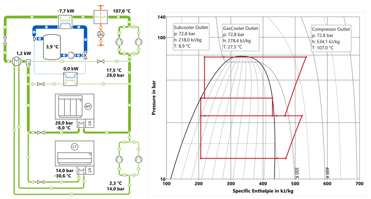

DaVE is a visualization software for post-processing and online display of dynamic data sets. It is widely used to visualize results of Modelica based simulations.

DaVE offers a wide range of both standard plot instruments, as well as thermodynamic state diagrams. Amongst others, pressure enthalpy (ph), temperature enthalpy (Th) diagrams of refrigerants, but also hx-charts for moist air can be used. For these thermodynamic diagrams, the cycle points from refrigerant and heat pump cycles or ventilation and air conditioning systems can automatically be loaded.
Additionally DaVE supports the creation of P&I flow diagrams. The connecting lines between the individual symbols can be linked with variables and dynamically change their width and direction. DaVE can also read the object-diagram information from Modelica and automatically generate the P&I diagrams.

This makes DaVE a powerful and helpful application for Modelica based simulations. With the new version 2023.1, TLK offers a free Lite Version which allows to experience and evaluate the features of DaVE.

Version 2023.1 of DaVE includes the following new features:
 - New documentation including tutorials for most commonly used features
 - New fluid property data, using TILMedia 3.14
 - Possibility to show current values on y-axis and in legend
 - New licensing scheme with only one license including all features

For further information see [dave.tlk-thermo.com](https://dave.tlk-thermo.com) or contact us at [dave@tlk-thermo.com](mailto:dave@tlk-thermo.com).
