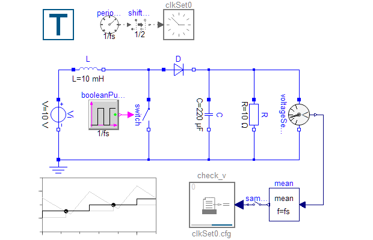

Dymola 2024x comes with an updated Testing library.
In this version we introduce clocked test blocks
to enable a new way of recording and comparing signals.

Previously all comparisons were done continuously,
but now tests can also be performed in a predefined interval using Modelica clocks.
This is not only beneficial for test of clocked models.
It also simplifies regression tests of continuous signals,
when recorded results with limited resolution are used as reference.

The screenshot shows how to check the output of a switched boost converter against a recording.
Due to the voltage ripple, we use a mean filter to average the measured
voltage and check the filtered signal once in the middle of every period.

The new clocked blocks include check blocks, recorders and clocked tables
for boolean, real and integer from scalar up to 3 dimensions.
Tick based tolerances are also available, to compare signals which might
be shifted by one tick or more.

To get started with clocked tests, load the library in Dymola and check out
the new examples in `Testing.Examples` or read the guide at `Testing.Clocked.UsersGuide`.
