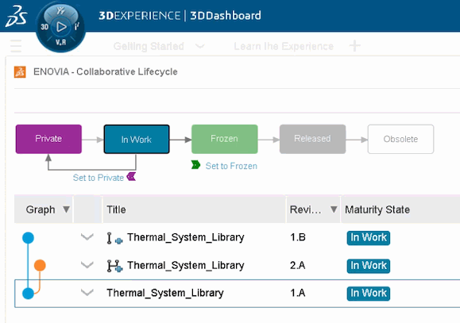

On 24 November 2023, Dymola 2024x becomes available for ordering and delivery.

#### Model editing

The Dymola standalone program has been connected to the 3DEXPERIENCE platform.
Models can be version controlled in 3DEXPERIENCE, and the complete lifecycle is
integrated with PLM tools. Furthermore, tools such as 2D/3D design and Project
Planning are available and can launch Dymola.

Support for Git has been improved, including modification status visible in the
Dymola package browser and a better model publishing dialog.

#### Simulation

Using a sparse solver for system of equations and a revised Jacobian approximation,
faster simulation of many large systems is possible.

FMI 3 support includes early return when an event occurs, intermediate input and input interpolation.
Variable step co-simulation make it possible to control the FMU step from the model.

#### Process Modeling Library

The library contains models to simulate thermal separa¬tion processes based on
multi-phase multi-component equilibria. It allows you to predict the behavior of
separation units, analyze heat and mass transfer processes, and to optimize operating
conditions to maximize efficiency and minimize energy consumption. Using the
Thermodynamics Connector library, complex media models available.

The library is used to troubleshooting complex systems, improve product quality,
and reduce the environmental impact.
