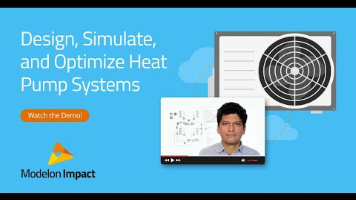

#### Cogeneration Power Plants: Improving Operations in Complex Conditions
 
Designing and implementing cogeneration power plants is inherently complex. Not only do engineers need to consider varying load changes over time, but, also, the cost to keep up this technology. Modelon explores 
the promise of model-based systems engineering to design [flexible and cost-efficient cogeneration power plants](https://modelon.com/blog/cogeneration-power-plants-improving-operations-in-complex-conditions/) using [Modelon Impact](https://modelon.com/modelon-impact/).
 
#### Modelon Impact for Heat Pump Design

 Engineers and HVAC professionals face unique challenges when designing residential heat pumps that are environmentally friendly and cost-effective. Modelon's cloud-based platform, Modelon Impact, comes equipped with the right components, example models, media models, and workflows within its Modelica-based libraries to help system engineers design and simulate state-of-the-art heat pumps. With Modelon Impact you can:
 
✅ Assess new refrigerants

✅ Size components and systems

✅ Predict efficiency variability

✅ Retrofit existing systems

✅ Optimize system design

✅ Evaluate operational flexibility

 
Watch the demo to see how Modelon Impact can help you design and improve residential heat pump systems: Modelon Impact Demo for the [Design of Residential Heat Pump Systems](https://www.youtube.com/watch?v=u3fvxqAmipU)

To get an understanding of the Modelica-based libraries and resources that Modelon Impact comes equipped with for residential heat pump design, download our [application brochure](https://modelon.com/support/revolutionizing-residential-heat-pump-design-brochure/)
 
 
#### Modelon Innovate 2024
 
Modelon's highly anticipated system simulation conference, Modelon Innovate, is back next year. Join us and other system modeling and simulation professionals around the globe in Copenhagen, Denmark to discuss the latest trends, success stories, and guides for getting the most out of Modelica-based system simulation technology. To be one of the first to find out when registration opens, sign up at ([Innovate 2024](https://modelon.com/innovate2024/))

---
