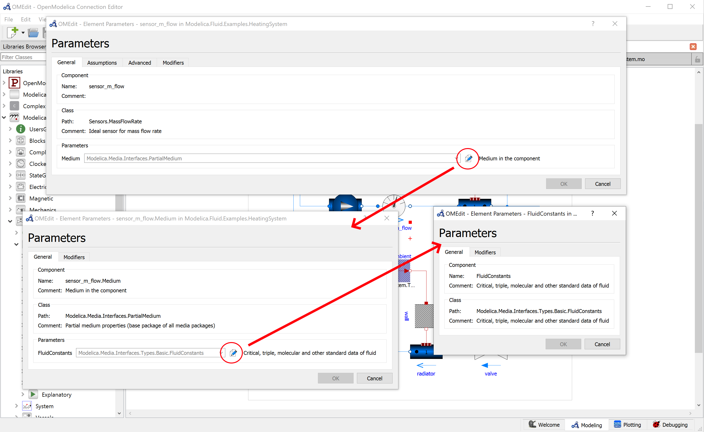

Version 1.22.0 of OpenModelica was released on Nov 8 2023.

The main highlight of the new release is a significant improvement of the OMEdit GUI,
made possible by the new instance-based architecture for the interaction between the OMEdit GUI and the underlying OMC compiler.
Thanks to that, OMEdit can now handle parameter-dependent conditional connectors and parameter inputs, as well as replaceable components and classes with parameter editing for the redeclared object.
Connection rendering was also improved, showing branching nodes in connection sets and improving the rendering of overlapping connections.

Several improvements were made to the C++ runtime:
  - Support for ExternalMedia library (fix record inputs of external functions and bindings of records to scalar variables).
  - Support for ThermofluidStream library (fix array dimensions of created temporary variables).
  - Preliminary support for DAE mode.
  - Fixed issue with start attributes for iteration variables of implicit nonlinear systems, which were previously lost.

The compiler frontend and backend has been further improved and many bugs were also fixed, leading to a much improved user experience, compared to the previous 1.21.0 release.

For further details, please check the [release notes](https://github.com/OpenModelica/OpenModelica/releases/tag/v1.22.0).