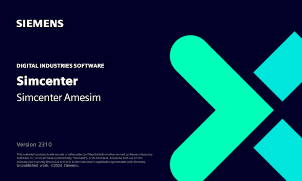
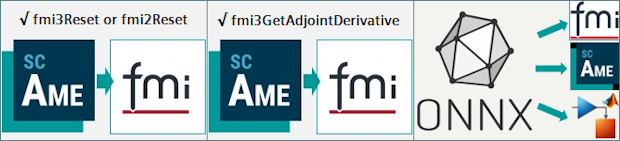

[Siemens Digital Industries Software](https://www.sw.siemens.com/ ) is pleased to announce that **Simcenter&nbsp;Amesim&nbsp;2310** has been released on October 27, 2023, as part of its [system simulation solutions]( https://blogs.sw.siemens.com/simcenter/whats-new-in-simcenter-systems-2310/). This release brings noticeable improvements to exported FMUs, for an easier deployability of system simulation models in a wide variety of simulation contexts. It also strenghtens the interoperability of Simcenter Amesim models with artificial intelligence (AI) frameworks.

## Improved capabilities of exported FMUs
With **Simcenter&nbsp;Amesim&nbsp;2310**, the capabilities of exported FMUs have been improved, which is especially useful for Hardware-in-the-Loop (HiL) but also for the overall robustness of FMI based simulations and workflows. 
* **A deployed FMU model can now be reinitialized during the simulation (&ldquo;hot reinit&rdquo;)**, optionally with new parameter values applied, without having to unload it. This allows calibration engineers to chain maneuvers or scenarios easily within their test sequencing software and/or on their real-time systems (e.g. successfully tested on [dSPACE&nbsp;SCALEXIO]( https://www.dspace.com/en/ltd/home/products/hw/simulator_hardware/scalexio.cfm) with 2.0 and 3.0 FMUs).
* **More meaningful constant values can now be defined as default inputs of models intended to be exported as FMUs**, which greatly improves the usability of open-loop simulations (for validating models before export), and the robustness of FMU initializations later on, when performed by non-expert users. As these more meaningful start values get automatically stored in exported FMUs, enabling their silent reuse, &ldquo;lazy&rdquo; FMI importing tools can indeed start simulations with a much higher degree of confidence.
* **Exported 3.0 FMUs can now optionally provide the adjoint derivatives**, in addition to the directional derivatives, which is typically needed for backpropagation in gradient-based training of artificial intelligence (AI) models. Users can thus encapsulate and train AI models more efficiently with Simcenter Amesim 3.0 FMUs, thus connecting the system simulation world to the Python/Julia tool world more easily. It also becomes possible to combine physics-based and AI-based models (e.g. neural ODEs) and training in a unified framework. 

## Easier reduction and/or hybridization of physical models with AI
In addition to the improved capabilities of exported FMUs, **Simcenter&nbsp;Amesim 2310 tightens the links between the Open Neural Network Exchange ([ONNX]( https://onnx.ai/)) and the Functional Mock-up Interface ([FMI]( https://fmi-standard.org/)) standards**. Thanks to the support of additional ONNX nodes that make sense for system simulation applications (35 nodes currently supported), the handling of pretrained neural networks is more robust for model reduction and/or hybridization purposes: **users can either replace CPU time-consuming parts of their physical models by pretrained neural networks, or convert these Reduced Order Models (ROMs) directly as lightweight FMUs for reuse**. They benefit from a higher compatibility with other recognized ONNX compatible software, such as [Simcenter Reduced Order Modeling]( https://plm.sw.siemens.com/en-US/simcenter/integration-solutions/reduced-order-modeling/), [Tensorflow]( https://www.tensorflow.org/), [PyTorch]( https://pytorch.org/) or [Julia]( https://julialang.org/). More will come in future releases. Stay tuned! 

For more information on Simcenter Amesim, please visit our [website](https://www.plm.automation.siemens.com/global/en/products/simcenter/simcenter-amesim.html ).
