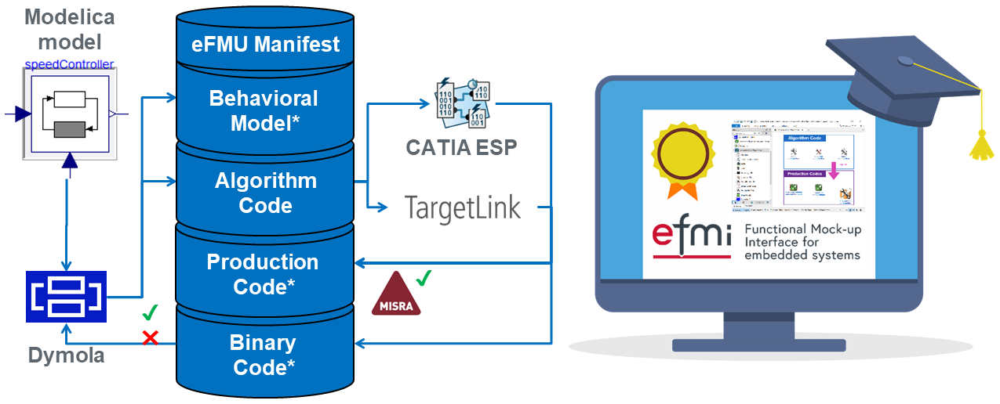

The recording and slides of the eFMI® Tutorial presented at the [15th International Modelica Conference](https://2023.international.conference.modelica.org/) (9th of October 2023) are now public available on [YouTube](https://youtu.be/oCDH-8mXeNw) (videos) and the [eFMI website](https://www.efmi-standard.org/) (slides & videos).

We had about 50 participants from 20 organizations and the feedback has been great! Close to all participants managed to follow the hands-on, for which we provided a portable Dymola & CATIA ESP with all required tooling like compilers, libraries etc included. Many of the participants got really excited and used the unique opportunity provided by the conference to discuss the feasability of eFMI in their application domain. **We like to thank each participant for joining the tutorial and your kind feedback!**

The complete tutorial is split into several independent parts:
 - [Part 1: eFMI® motivation and overview](https://youtu.be/oCDH-8mXeNw)
 - [Part 2: Running use-case introduction](https://youtu.be/ghalwWlbSOA)
 - [Part 3: Hands-on demonstration in Dymola and CATIA ESP](https://youtu.be/n-aIFpxDtWE)
 - [Part 4: Live demonstration in TargetLink](https://youtu.be/XeBVj6-_w0Q)
 - [Part 5: Short presentation of further tooling](https://youtu.be/GF_YNonNMYs)

It covers the current state-of-the-art of available eFMI tooling, including a high-level introduction to the _eFMI Standard_ (Part 1), and a hands-on experience of eFMI technology for selected Modelica example models (Parts 2 & 3). It shows how to configure a tooling workflow from acausal physics models in Modelica down to embedded target code (Parts 3 & 4) and investigates the generated eFMUs and their various intermediate model representations. The focus is on the non-functional quality criteria satisfied by the generated solutions, like traceability within eFMUs, MISRA C:2012 conformance of generated production code and other code quality criteria like static memory allocation and error handling.

If you have any general questions or feedback on what you think we need to improve or also cover in such tutorial, please contact us on our _public_ mailing list, [`efmi-info@googlegroups.com`](https://groups.google.com/g/efmi-info) (no Google account required) or write a _private_ mail to `Christoff.Buerger@3ds.com`.

**Your feedback is very welcome!**
