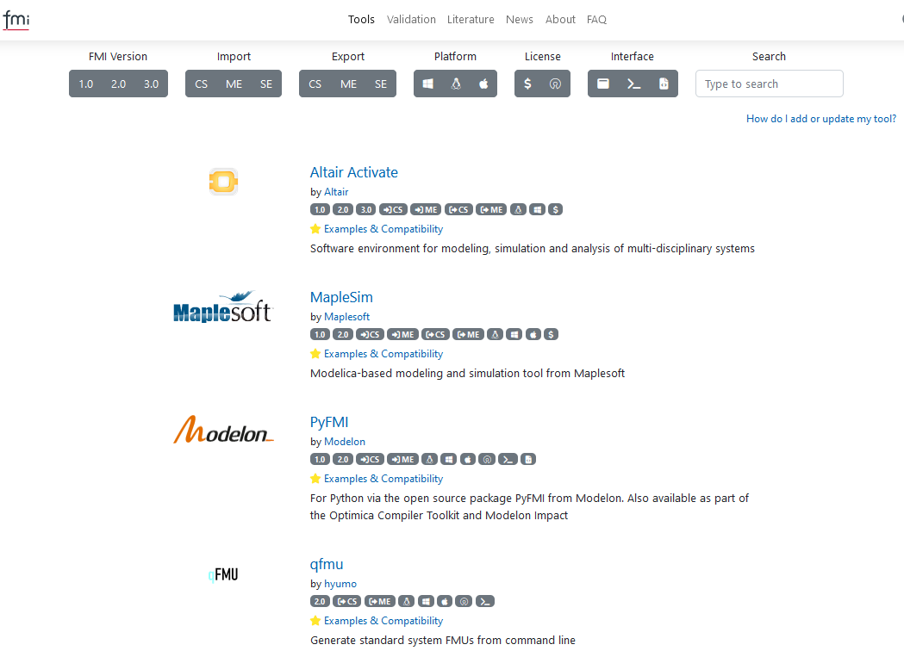
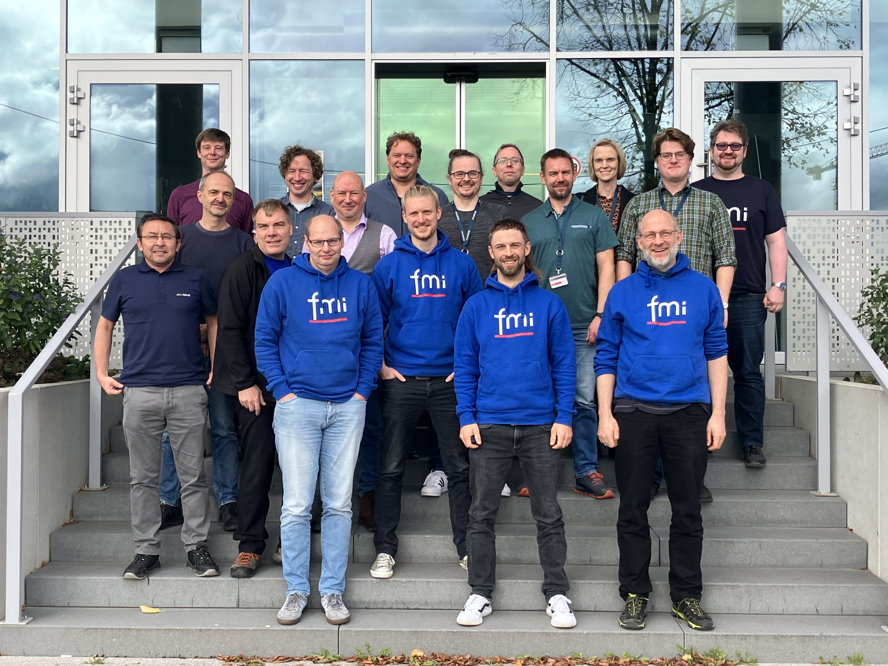

{::options parse_block_html="true" /}

### FMI at the Modelica Conference

It was great to meet the FMI users and developers again in person at the Modelica Conference in Aachen!
The papers are avaialable as preprints in the [conference session overview](https://www.conftool.com/modelica2023/sessions.php).

### FMI Beginners' tutorial available

Watch the recording of the "FMI Beginners' tutorial" from the Modelica Conference 2023 in Aachen [on YouTube](https://www.youtube.com/watch?v=RlAafdCKCHU), material available [here](https://github.com/modelica/fmi-beginners-tutorial-2023). 
Thanks to Cinzia Bernardeschi, Christian Bertsch, Cláudio Gomes, Maurizio Palmieri, Torsten Sommer for jointly preparing and holding this tutorial!

### FMI Compatibility Information provided in the FMI Tools list

The [FMI tools page](https://fmi-standard.org/tools/) now lists 192 tools supporting tools!

The tools listed on top and marked with the golden star now provide "compatibility information": 
They document how the tool vendors have tested their FMU import and export capabilities and standard compliance with other tools. 
Exporting tools also provide example FMUs, that can be tested by other importing tools.
This information is provided on an external webpage or repository in the responsibility of the tool vendors.

### FMI Design Meeting in Nov 2023 in Sindelfingen, Stuttgart

FMI developers from Akkodis, AVL, Bosch, Dassault Systemes, dSPACE, EKS-INTEC, ESI, ETAS, PMSF, Synopsys, and Wolfram MathCore participated.
Thanks to Akkodis for the great hospitality!

We focused on layered standards to FMI 3.0

- [FMI-LS-XCP](https://github.com/modelica/fmi-ls-xcp) for XCP support (v1.0RC2 in preparation)
- [FMI-LS-BUS](https://github.com/modelica/fmi-ls-bus) for network communication (v1.0alpha in preparation)
- [FMI-LS-STRUCT](https://github.com/modelica/fmi-ls-struct) for maps and structuring of variables (concept work)
- and new ideas for layered standards reference source models, reference solutions, parameters sets

Additionally we discussed possible efficiency optimizations for data transfer and access that can be addressed in FMI 3.1 (see also next paragraph).

### Call for Problems 

Currently the FMI project starts working on FMI 3.1 and would like the to ask the FMI user community to **report their current pain points and ideas for future development**.
We currrently have the idea to work on efficiency: we have identified that for FMUs that handle a large amount of data communication compared to internal calculations, the current desig of FMI leads to overhead due to copy operation of data. 
This could be either due to a very large amount of scalar variables, or large data amounts in form of array or binary variables. Several solution approaches are in discussion, but currently the problem itself his not yet fully clear and has not yet been described in detail.
So, if you face efficiency problems in the simulation of FMUs that can be traced back to communication overheaed, please report them to us in form of use case descrption and problem statement.

More generally, **if you have problems w.r.t. model exchange and co-simulation that cannot yet be solved well with FMI 3.0**, please describe and send them either in the form of an [Github issue](https://github.com/modelica/fmi-standard/issues) or via e-mail to [contact@fmi-standard.org](contact@fmi-standard.org).

#### Other resources and discussion forums for FMI related questions

- Join the [LinkedIn FMI community](https://www.linkedin.com/groups/7477473/) to get the latsted news on FMI, FMI supporting tools and discussions within the user community.
- Follow the [Modelica Association on LinkedIn](https://www.linkedin.com/company/modelica-association?originalSubdomain=se) to keep up to date w.r.t. the Modelica language and libraries, and the #FMI, #SSP, #DCP and #eFMI standards.
- Ask technical questions and discuss topics on the usage of FMI on [Stackoverflow tagged "FMI"](https://stackoverflow.com/questions/tagged/fmi).
- Report problems of the standard itself or suggestions for new features in form of issues on on [fmi-standard.org](https://github.com/modelica/fmi-standard/issues).
