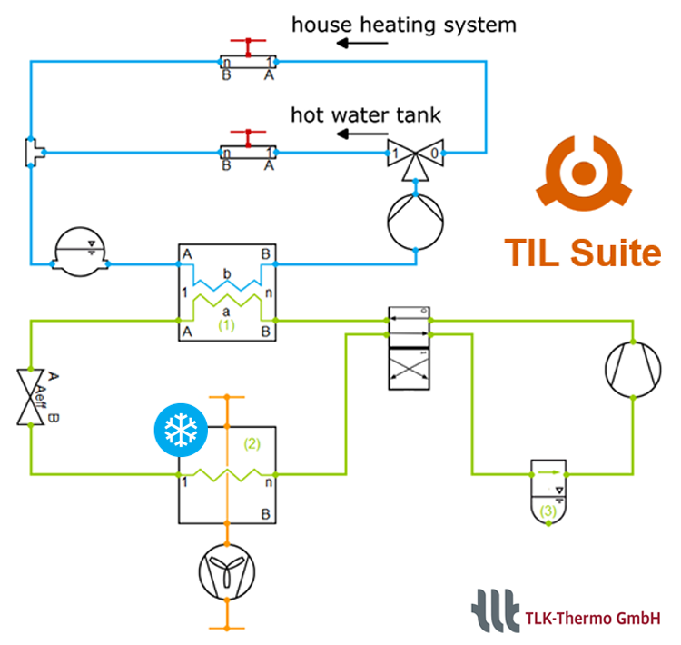

The TIL Suite is a comprehensive Modelica library for stationary and transient simulations of thermodynamic systems. In November the **TIL Suite 3.15.0** will be released and among others, the following new features are included:
- 4-way reversing valves for refrigerants are now available. The TIL example of a reversible air-to-water heat pump with periodic freezing and defrosting now uses a 4-way reversing valve.
- The provision of all function derivations in TIL and TILMedia for the use of the analytic Jacobian matrix in Modelica solvers has been improved, especially for TIL HD. This can increase computing speed.

We are also continually improving frosting models in the TIL Suite and provide well documented models, which can be simple and easy to parametrize or use more detailed approaches with flexible settings for ice formation.

In addition to components and example systems already contained in TIL, many other add-on libraries are available. We provide add-ons for hydrogen energy systems, thermal storages like hot water tanks, and automotive applications, among others.

For further information about TIL Suite see [www.tlk-thermo.com](https://til.tlk-thermo.com) or contact us at [til@tlk-thermo.com](mailto:til@tlk-thermo.com).
