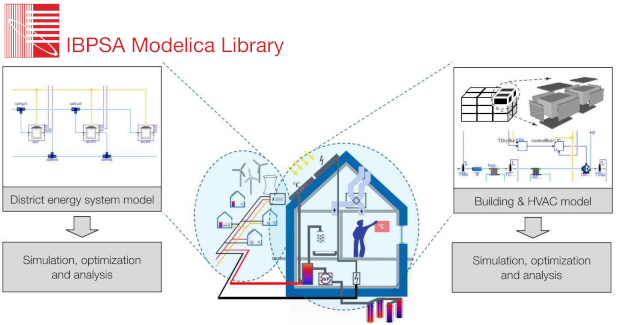

This workshop will teach fundamentals for HVAC and control modeling using the [Modelica IBPSA Library](https://github.com/ibpsa/modelica-ibpsa)
and [OpenModelica](https://openmodelica.org/)'s OMEdit environment.

In this workshop, developers of the AixLib, Buildings, BuildingSystems and IDEAS Libraries and of the OpenModelica environment will
give an introduction to OMEdit and present best practices for modeling HVAC and control systems with Modelica.
The workshop is targeted to new users.
Participants will conduct hands-on exercises using OMEdit and the Modelica IBPSA Library.
The workshop will close with an overview of the four libraries that use the Modelica IBPSA Library as their core.

*About the Modelica IBPSA Library*

The Modelica IBPSA Library is a free open-source library that is used as the core of the Modelica
[AixLib](https://ebc-tools.eonerc.rwth-aachen.de/en/aixlib),
[Buildings](https://simulationresearch.lbl.gov/modelica/),
[BuildingSystems](https://modelica-buildingsystems.de/) and
[IDEAS](https://github.com/open-ideas/IDEAS) libraries.
The Modelica IBPSA Library has been developed over the past decade, from 2012-17 as part of [IEA EBC Annex 60](https://www.iea-annex60.org/), from 2017-22 as part of [IBPSA Project 1](https://ibpsa.github.io/project1/)
and since 2022 as part of the [IBPSA Modelica Working Group](https://ibpsa.github.io/modelica-working-group/).

*Agenda and Registration*

For workshop agenda, visit https://github.com/ibpsa/modelica-working-group/wiki/2023-10-09-Tutorial-Aachen

Registration for the workshop is done through the [conference registration](https://2023.international.conference.modelica.org/registration.html).