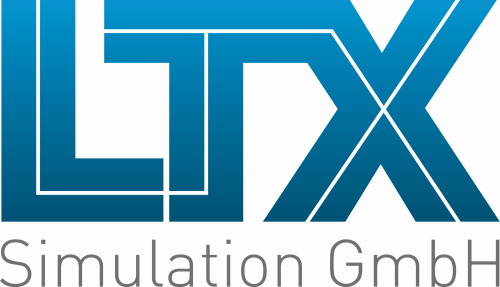

{:width="250px"}

LTX is sponsoring the conference in Aachen as a
platinum sponsor. The main motivation is to give back some of the funds we charge for operating Modelica Association Backoffice. 

We are looking forward to talk to you at our booth, if your are interested in

- Info about **Dymola licenses & Dymola features**
  (especially for German speaking market)

- **Hands-on look into Modelica Libraries** (e.g. TIL,
  HumanComfort, HVAC, Visualization, Cables, ...)

- **Modelica Association Clothing**: We won‘t sell merch
  because we don‘t know which sizes to order in advance. But, you can try on all
  T-Shirt sizes in to find the right fit for you. Orders can be placed in the [MA merch shop]()https://ma-merch.myspreadshop.de/)

- **Research on Modelica Technology**. Matthias Schäfer contributed the  [ScalableTranslationStatistics Library](https://ltx.de/download/ModelicaLibraries/ScalableTranslationStatistics) (available on Github) to the presentation  [Accelerating the simulation of equation-based models by replacing non-linear algebraic loops with error-controlled machine learning surrogates](https://www.conftool.com/modelica2023/index.php?page=browseSessions&form_session=28#paperID181) by Heuermann et. al. on Tuesday, October 10, 2023, 15:30 in Room Silver

- **Working at LTX**: We are looking for Modelica specialists in different fields. Example job opportunity: [Berechnungsingenieur:in Wärmepumpensimulation (m/w/d)](https://ltx.de/download/stellen/20230214_Stellenbeschreibung_Waermepumpensimulation_LTX.pdf)

If you would like to arrange a personal meeting, please
contact [info@ltx.de](mailto:info@ltx.de). 
