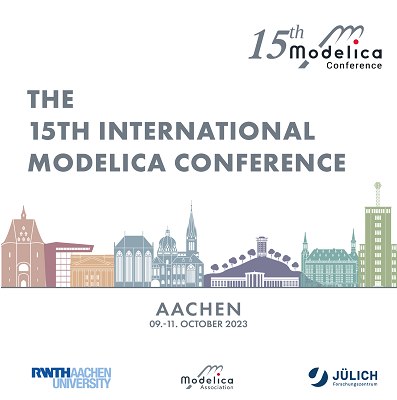

Dear Modelica, FMI, SSP, DCP, eFMI interested,

The **[International Modelica Conference 2023](https://2023.international.conference.modelica.org/)** will take place
**Mo. Oct. 9 - Wed. Oct. 11, 2023, in Aachen, Germany**, as a **face-to-face conference**. 

This Newsletter is a special edition for this conference. You get here an overview of the most important topics.
More details are given in the articles and on the conference web page.

#### Scientific papers available
The scientific papers of the conference are already available for everyone:
Clicking on [sessions](https://www.conftool.com/modelica2023/sessions.php) and then on a particular session, will
show the abstracts together with the pdf-documents of the session papers.
Scientific papers are presented on Tue. Oct. 10 and Wed. Oct. 11.

#### Two keynotes
There are keynotes about [Dealing with complex models and how to use the idealization of physics to our advantage](https://www.conftool.com/modelica2023/index.php?page=browseSessions&form_session=15)
from Dr. Dirk Zimmer ([DLR-SR](https://www.dlr.de/sr/en/desktopdefault.aspx/tabid-11579/)) on Tue. and about [Relevance of Dynamic Simulation of complex systems in Building Technology - review and outlook
](https://www.conftool.com/modelica2023/index.php?page=browseSessions&form_session=32) from Dr. Bruno Lüdemann ([ROM Technik](https://rom-technik.de)) on Wed.

#### 8 Tutorials
On Mo., Oct. 9, 13:30 - 16:30, there are eight, free tutorials for various topics.
Click on [sessions](https://www.conftool.com/modelica2023/sessions.php), select Monday and then
the respective tutorial. This shows an abstract and pre-requisits for the tutorial
(e.g. software that you should download before the tutorial, and/or expected knowledge).
Please, mark during registration the tutorial that you plan to visit to help with the organization of the tutorial
(if you already registered, you will get soon an email how to provide this information). 
More information to some tutorials are given in the articles below.

#### Vendor presentations
On Mo., Oct. 9, 17:00 - 19:15, there are various vendor presentations.
Click on [sessions](https://www.conftool.com/modelica2023/sessions.php), select Monday and then
the respective vendor session. This shows the vendor and an abstract.
More information to some vendor presentations are given in the articles below.

#### Exhibition
There is a permanent exhibition during the conference. You can see the list of the
exhibitors in the left column of the **[Conference web page](https://2023.international.conference.modelica.org/)**.
Exhibitor LTX is also the backoffice of the Modelica Association (MA) and will provide MA material.

#### FMI user meeting
On Tue., Oct 10, 13:45 - 15:00, there is an [FMI User Meeting](https://www.conftool.com/modelica2023/index.php?page=browseSessions&form_session=22).

#### Modelica Association meeting
The day after the conference, on Thur. Oct. 12, there are various meetings from the Modelica Association and other organizations at RWTH Aachen,
close to the conference location. An initial schedule is given on the **[Conference web page](https://2023.international.conference.modelica.org/)**.
The meetings are open to guests and provide an opportunity to get in contact with the Modelica Association and
associated projects and publicly discuss ideas, feedback, requirements and new use cases. If you plan to participate please write to
the provided email addresses to help with the organization. 

I hope to see you at the conference and especially at the welcome reception on Mo. Oct. 9, 19:15 - 21:00.

Martin Otter on Sept. 14, 2023

Chairperson of the Modelica Association

*This article was provided by Martin Otter [Modelica](https://www.modelica.org/)*

### Invitation from local organizers

{:width="400px"}
We, the local organizers of this year's Modelica conference are looking forward welcoming you in Aachen. We managed to book [Das Liebig](https://dasliebig.de/) as conference venue, a former industrial building, which was recently renovated and is now one of the most modern conference sites in Aachen.
With valuable input by the Modelica community, we did compile a diverse [Conference Program](https://www.conftool.com/modelica2023/index.php?page=browseSessions), which includes interactive Tutorials, Vendor Presentations, as well as scientific posters and sessions.

We are a total of three instutes organizing this conference.

#### [Institute for Energy Efficient Buildings and Indoor Climate](https://www.ebc.eonerc.rwth-aachen.de/cms/~dmzz/E-ON-ERC-EBC/lidx/1/)
With more than sixty scientists, employees in technology and administration, and other student workers, the Institute for Energy Efficient Buildings and Indoor Climate has its research focus on the reduction of energy demand to create thermally comfortable interiors.

In addition to the main consideration of buildings, vehicle interiors are also investigated. The coupling of measures on the building exterior and system technology to increase the energy efficiency of buildings lies within the context of energetic district approaches with the linkage of thermal and electrical networks. For the development of decentralized energy supply concepts with integration of renewable energy sources, concepts of generation-, load-, and storage-management with intelligent communication between all components are devised.
The work of the institute is based on comprehensive test equipment and advanced simulation methods, as well as the coupling of simulation and real hardware using hardware-in-the-loop and FMI.
The institute developed and maintains the open-source Modelica libraries [AixLib](https://github.com/RWTH-EBC/AixLib) and [BESMod](https://github.com/RWTH-EBC/BESMod), and uses Modelica as the central simulation method.

#### (Institute for Automation of Complex Power Systems)[https://www.acs.eonerc.rwth-aachen.de/cms/~dlkd/E-ON-ERC-ACS/lidx/1/]
The goal of ACS is to implement a multidisciplinary research approach able to capture the most recent advances in ICT to support the solution of the most advanced problems in the area of grid dynamics and automation.

In order to achieve this vision the research in ACS is organized around three main pillars:
- Grid operations
- ICT for Energy
- Control and Automation
Thanks to a multidisciplinary team that works at the intersection of traditional power systems with advanced control and automation concepts and modern ICT solutions, the research at ACS can cover, in a unique way, the following scientific areas:
- Joint analysis and design of power grid and communication infrastructure in future grids
- Modern control architectures and protection techniques
- Electrical distribution and usage in home, neighborhood and urban energy systems
- Distributed measurements and monitoring
- Data driven solutions for energy systems
- Future Internet for energy systems
- Advanced computing for simulation applications
- Real time simulation and Hardware-in-the-Loop testing
- System software and computer architectures for parallel co-simulation of power and communication systems

ACS constantly develops and expands an advanced testing facility, a research topic in itself, installed in the ACS laboratory with unique custom solutions for
- real-time simulation of power grids,
- hardware in the loop testing,
- power hardware in the loop testing,
- mixed power, control and communication simulation.

#### (Institute of Energy and Climate Research (IEK) - Energy Systems Engineering (IEK-10)](https://www.fz-juelich.de/en/iek/iek-10)
IEK-10 develops models and algorithms for the simulation, optimization and control of energy systems, which are characterized by a high spatial and temporal variability of energy supply and demand, an increasing degree of intersectoral dependencies as well as an increasing digitalization. The focus is on multi-physical energy grids, industrial energy systems, and buildings and districts. A major goal of the research is to provide scalable and faster-than-real-time capable methods and tools that enable energy-optimal, cost-efficient and safe design and operation of these future energy systems. For this purpose, physical-technical system descriptions are combined with machine learning methods and customized simulation and optimization methods are developed especially for multicore, cluster and high-performance computers, which enable the handling of large-scale problems. With the help of the Reallabor "Living Lab Energy Campus" as well as a "Hardware-in-the-loop" laboratory, these innovative solution approaches for future energy systems are tested and validated under almost realistic conditions.

