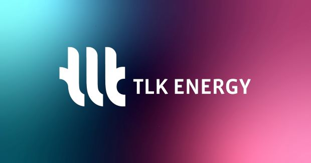

This year [TLK Energy GmbH](https://tlk-energy.de/) is Silver Sponsor of the Modelica Conference in Aachen. 
Yann Pellny will give a presentation on "Balance of Plant Simulation for Electrolyzers". He will present TLK's work in collaboration with Neuman & Esser on the highly topical issue of hydrogen production.
In general, the efficiency and power density of Proton Exchange Membrane (PEM) electrolyzers depend on several factors, such as the membrane itself, the liquid distribution, its design and the resulting heat and mass transfer. 

To ensure safe and efficient operation under transient conditions, various parameters such as stack temperature and membrane moisture must be controlled.
This is referred to as "Balance of Plant". Here, simulation offers an excellent tool to analyze the overall system and find the right control strategy. 

Yann will present a simulation model, that uses two simulation libraries:
1. [PSL - Process Systems Library](https://tlk-energy.de/en/software/process-systems-library)
2. [TIL Suite with the Add-On Hydrogen Systems](https://tlk-energy.de/en/software/til-suite)

When? October 10, 2023, approx. 3:45pm - 4:15pm 
Where? Room Carbon

Visit us at the conference for a face-to-face meeting. We look forward to discussing your use cases and demonstrating our tools.
