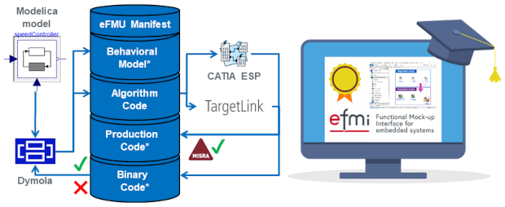

{:width="620px"}

**Time:** Monday, 09/Oct/2023, 1:30pm--4:30pm (including 30min coffee break)

We are happy to announce that there will be an extensive tutorial on current [eFMI®](https://www.efmi-standard.org/) tooling [at the conference](https://www.conftool.com/modelica2023/index.php?page=browseSessions&form_session=2). The tutorial will demonstrate the current state-of-the-art of available eFMI tooling. Participants will get a very high-level overview of the eFMI worklflow and a _hands-on experience_ of it for selected Modelica example models. They will configure a tooling workflow from acausal physics models in Modelica down to embedded target code and have a chance to investigate the generated eFMUs and their various intermediate model representations. Besides setting up and experiencing the eFMI workflow, we will also focus on the non-functional quality criteria satisfied by the generated solutions, like traceability within eFMUs, MISRA C:2012 conformance of generated production code and other code quality criteria like static memory allocation and error handling.

**Requirements:** To conduct the tutorial, participants have to bring their own computer with Windows 10 or 11, 64-Bit, x86. All required software -- except operating system -- will be provided to participants via a password protected download, available two days ahead; **please write an e-mail to Christoff.Buerger@3ds.com (MAP eFMI project leader) that you like to participate** to get timely access. It would be very kind when you download the provided software ahead of time to reduce your preparation time and risk of technical issues at the tutorial. Thank you!

If you have any general questions regarding the tutorial, you can contact our _public_ mailing list, [`efmi-info@googlegroups.com`](https://groups.google.com/g/efmi-info) (no Google account required).
