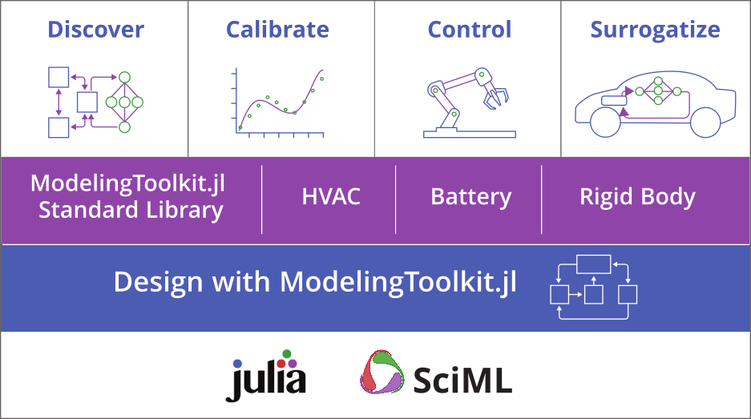

# JuliaSim

At the [International Modelica Conference
2023](https://2023.international.conference.modelica.org/),
[JuliaHub](https://juliahub.com) will be discussing their next-generation
modeling and simulation platform,
[JuliaSim](https://juliahub.com/products/juliasim/). Vice President of Modeling
and Simulation, Chris Rackauckas, and Senior Director of Product Management for
JuliaSim, Michael Tiller, will be on hand to discuss the latest features in our
new JuliaSim tool as well as the platform it is built on, [JuliaHub](https://juliahub.com).

In particular, we'll be discussing
[`ModelingToolkit`](https://docs.sciml.ai/ModelingToolkit/dev/), an *open
source* Julia package for building high-performance symbolic-numeric equation
based models.  We will also be discussing our new [HVAC and Battery
libraries](https://help.juliahub.com/juliasim/stable/?_gl=1*1yf078s*_ga*MTU5NjU5MDY5Mi4xNjkzNTcwMzY3*_ga_8FC7JQQLXX*MTY5NDgwNzIyNS4xNC4xLjE2OTQ4MDg5MjkuMC4wLjA.#Pre-Built-Model-Libraries)
built on top of ModelingToolkit which will be available in our
forthcoming web-based modeling environment, JuliaSim.  Finally, we'll be
discussing how our new [Digital Echo
methdology](https://help.juliahub.com/juliasimdigitalecho/stable/?_gl=1*6aga0j*_ga*MTU5NjU5MDY5Mi4xNjkzNTcwMzY3*_ga_8FC7JQQLXX*MTY5NDgwNzIyNS4xNC4xLjE2OTQ4MDkzMTYuMC4wLjA.)
allows customers to transform their existing, physics-based models (including
FMUs) into surrogate models which are accurate to within a few percentage points
but run significantly faster.  The performance of these tools is described in
[the following paper](https://arxiv.org/abs/2103.05244) which shows how an HVAC
model, running in the JuliaSim environment and leveraging our Digital Echo
surrogate technology, demonstrated a 590x speed-up over previous models.

We will be happy to answer questions about these technologies or any of our other technologies like our model calibration and optimization tools or our control system design and analysis capabilities.  We are looking forward to seeing you all at the International Modelica Conference 2023, in Aachen.

