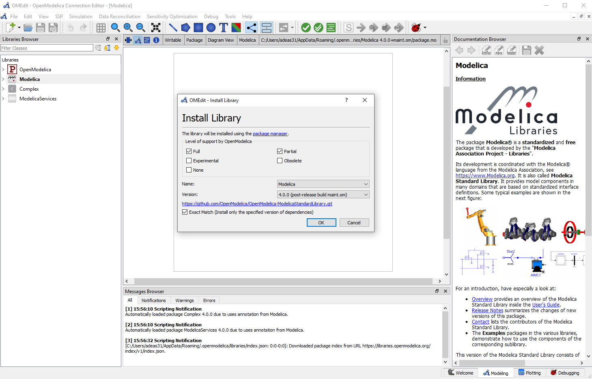

The Open Source Modelica Consortium is happy to announce the recent OpenModelica 1.20 release.

The first most notable feature of this release is the automatic installation of the Modelica Standard Library (MSL), which is now fully integrated with the Package Manager. Every time any tool of the OpenModelica suite (e.g. OMEdit, OMNotebook, OMShell, etc.) attempts to load a version of the MSL, it checks if it has already been installed in the user's set of system libraries, which is handled by the Package Manager and is located in the user's .openmodelica directory. If that directory is empty, either because of a fresh install, or because it has been deleted, then the MSL is automatically installed in the user's system libraries from cached zip files in the OpenModelica installation directory; in fact, both MSL 3.2.3 (which is backwards compatible with 3.2.2 and 3.2.1) and 4.0.0 are installed, so that any library created during the last ten years can run out of the box.

This automatic installation does not require any Internet connection, so it also works behind corporate firewalls or in situations with limited available bandwidth. This solution uses the same package manager that is also used to install other system libraries, contrary to the solution implemented in versions 1.18.0 and 1.19.x, which used two different directories in the MODELICAPATH, one for the package manager and one for the preinstalled MSL, leading to slightly confusing duplicate installations of MSL.

OMEdit loads MSL 4.0.0 by default in the Libraries Browser. However, if one then loads a package using MSL 3.2.3, it is possible to unload MSL 4.0.0 and load MSL 3.2.3 just with a click of a button.

The second most notable feature is that a new general purpose ODE solver, named gbode, was introduced. This solver is a fully configurable single-step solver, supporting many different integration methods, both explicit and implicit, using either fixed time step or variable time step with error control, handling event detection and dense output for accurate resampling over a regular time grid. Implemented methods include Euler, Heun, Dormand-Prince, Gauss, Radau, Lobatto, Adams-Moulton, Fehlberg, SDIRK, ESDIRK, etc. Adaptive multi-rate algorithms are also available within this solver, although this feature is still experimental. This solver replaces previously available solvers like euler, impeuler, trapezoid, etc., which are now deprecated and will be removed in future versions of the tool.
The gbode solver is currently only available via simulation flags, which can be set in OMEdit under Simulation Setup | Simulation Flags | Additional Simulation Flags (optional). It will be supported via drop-down menus in future releases. See the User's Guide under [Solving Modelica Models](https://openmodelica.org/doc/OpenModelicaUsersGuide/1.20/solving.html) for further information.
