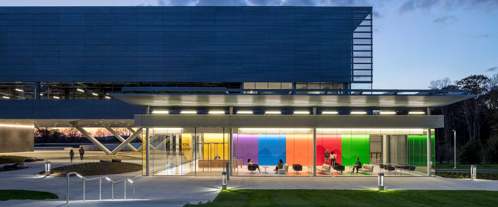

We would like to announce the [American Modelica Conference 2024](https://modelica.org/events/american2024/), which will be an in-person conference event, with an option to watch presentations streamed online for a reduced conference admission fee.

The conference will take place at the **University of Connecticut in Storrs** in the [Innovation Partnership Building](https://techpark.uconn.edu/) from **October 14–16, 2024**. It is organized by [NAMUG](https://namug.org/), the North American Modelica Users' Group, in cooperation with the [Modelica Association](/association/). Join us in person in Storrs or from the comfort of your own home.

## About the Conference
As part of the conferences promoted by the [Modelica Association](/association/), the [American Modelica Conference 2024](https://modelica.org/events/american2024/) is the main event in North America for users, library developers, tool vendors and language designers to share their knowledge and learn about the latest scientific and industrial progress related to [Modelica](https://modelica.org/), [FMI](https://fmi-standard.org/), [SSP](https://ssp-standard.org/), [eFMI](http://efmi-standard.org/) and [DCP](https://dcp-standard.org/).
The program will cover processes and tools for the modeling of complex physical and cyber-physical systems as applied to a wide range of research and industrial applications.

In addition to paper presentations, the conference features several Modelica tutorials for beginners and advanced users, as well as industrial user presentations, vendor sessions, and an exhibition.  The previous [American Modelica conference in 2022](https://2022.american.conference.modelica.org/) was also streamed, giving many Modelicans in other continents the opportunity to watch presentations on the latest updates on Modelica-related research and innovation.  In this version of the conference, we want to combine the ease of attendance by remote participants from other continents with the stimulating environment of an in person event with lively discussions in the breaks and an in-person conference dinner! 

Please note that **full paper presentations are required to be in person**, while industrial user presentations can be given remotely.

## Student Paper Competition

In building on the successes of the previous American Modelica conference, we are also happy to announce a Student Best Paper competition.  Additional details are available in the [call for papers](https://modelica.org/events/american2024/call2024/).

## Call for papers, user presentations and tutorials

Please see the [call for papers](https://modelica.org/events/american2024/call2024/) for details about paper submissions, and the calls for [industrial user presentations](https://modelica.org/events/american2024/call2024/#:~:text=by%20a%20DOI.-,Call%20for%20Industrial%20User%20Presentations,-You%20are%20encouraged), [workshops and tutorials](https://docs.google.com/forms/d/e/1FAIpQLScsRLAe-YwK7yAQoW6B5KQQ87M_SU4dgj6eKnvpjG3h53HMGw/viewform), and vendor presentations. Please look at the [author instructions](https://modelica.org/events/american2024/authors/) before submitting. The submission deadlines are as follows:  

- May 1, 2024: Submission of full papers
- June 1, 2024: Submission of extended abstracts for presentation-only contributions, [workshops and tutorials](https://docs.google.com/forms/d/e/1FAIpQLScsRLAe-YwK7yAQoW6B5KQQ87M_SU4dgj6eKnvpjG3h53HMGw/viewform)
- August 1, 2022: Notification of acceptance for papers and presentations
- August 30th, 2022: Submission of final papers and one-page abstracts
- October 7th, 2022: Submission of final presentations

## Sponsorship opportunities

The American Modelica conference will be your opportunity to meet your customers again in a personal setting, at a great location. 

**For sponsorship opportunities, please send an email to:** **[modelicaNA2024@groups.liu.se](mailto:modelicaNA2024@groups.liu.se)**

## Organization and Contact

The conference is organized by NAMUG in cooperation with the [Modelica Association](https://modelica.org/).

**For general questions, please send an email to:** **[modelicaNA2024@groups.liu.se](mailto:modelicaNA2024@groups.liu.se)**

### Conference Board

  -  **Conference Co-Chair** Dr. Michael Tiller, Juliahub
  -  **Conference Co-Chair** Dr. Hubertus Tummescheit, Modelon
  -  **Local Co-Chair** Prof. George Bollas, University of Connecticut
  -  **Program Chair** Prof. Luigi Vanfretti, Rensselaer Polytechnic Insitute
  -  **Program Chair** Dr. Michael Wetter,Lawrence Berkeley National Laboratory
  -  **Conference Excecutive Coordinator** Dr. Christopher Laughman, Mitsubishi Electric Research Laboratories
  -  Behnam Afsharpoya, Dassault Systemes
