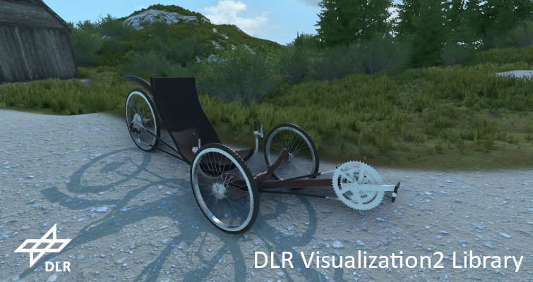

Elevating Modelica Simulation with Cutting-Edge Visualizations

DLR-SR announces the DLR Visualization2 Library, a Modelica library engineered to enable 3D and 2D real-time visualizations for multi-domain simulations with Modelica / Simulink / Python / Julia / C / C++.

Designed to meet the evolving needs of engineers and simulation professionals, the DLR Visualization2 Library boasts a range of features that allow for the creation of high-quality, interactive simulation experiences with state of the art realistic graphics.

#### Key Features of the DLR Visualization2 Library:

- Rigid Visualizer Blocks:
	- Parametrical shapes (boxes, spheres, gearwheels, springs, etc.)
	- CAD files support in current formats: glb, 3ds, obj, stl
	- (Georeferenced) terrain databases, including CESIUM streaming of map data
- Flexible Visualizer Blocks:
	- Flexible surfaces with texture (image and video, render to texture of camera image)
	- Flexible, free deformable CAD models for the visualization of structural elasticity
	- Support for rigged CAD models (e.g. serial kinematics, robots, human bodies, etc.)
- 2D Overlays and Graphical User Interfaces:
	- 2D Overlays such as lines, polygons, textures
	- Predefined elements like graphs, maps, and diagrams
	- GUI elements including buttons, sliders, checkboxes, etc., for interactive simulations
- Video Export:
	- Video export in common formats such as H.264, H.265, WMV, MPEG4, etc.
	- Automatic video export/screenshots during or after the simulation for effortless documentation
- Cameras and VR:
	- Cameras, free movable or fully controlled by the simulation
	- Multiple views on the scene, including picture-in-picture
	- Fullscreen and multi-monitor support
	- OpenVR (HTC Vive, Oculus Rift) compatibility for seamless VR simulations

The DLR Visualization2 Library is commercially available via LTX. For the free community version and more information on the libary, visit [here](https://www.sr-scil.de/simulationsbibliotheken/kommerziell-verfuegbar/visualization/).
