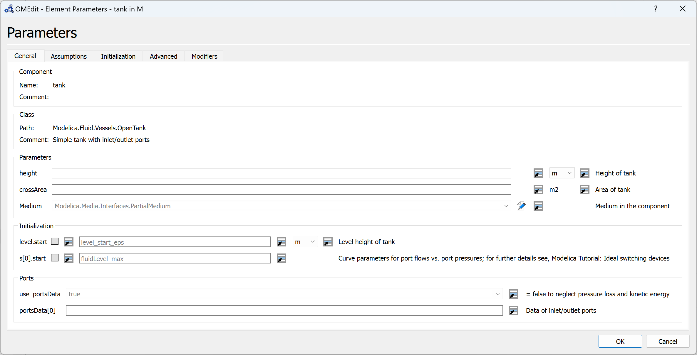
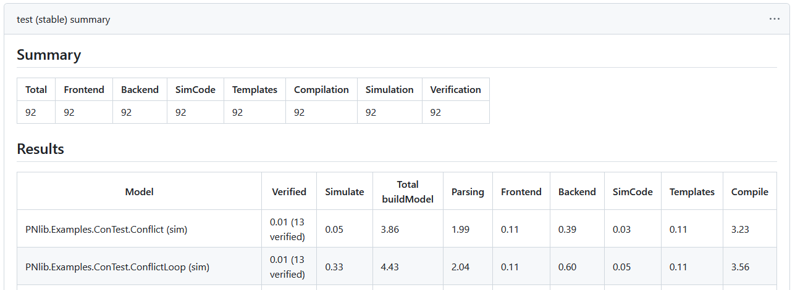

#### Version 1.22 bug fix releases

Some issues were identified in the 1.22.0 release. We released two bug fix
releases 1.22.1 and 1.22.2. 1.22.3 will soon be available.

The releases contains following improvements:
  - Bug fixes in the OMEdit GUI.
  - Issues related to the replaceable components and classes in the parameters
    window.
  - Support for final and each modifiers.
  - FMI Export

For complete list of bug fixes see milestones
[1.22.1](https://github.com/OpenModelica/OpenModelica/milestone/48?closed=1),
[1.22.2](https://github.com/OpenModelica/OpenModelica/milestone/49?closed=1) and
[1.22.3](https://github.com/OpenModelica/OpenModelica/milestone/50?closed=1)

#### Library Testing

Two [GitHub actions](https://docs.github.com/en/actions) for automated testing and
verification with OpenModelica have been published:

  - [OpenModelica/setup-openmodelica](https://github.com/OpenModelica/setup-openmodelica):
    Install OpenModelica and Modelica libraries on GitHub Ubuntu and Windows
    runners.
  - [OpenModelica/openmodelica-library-testing-action](https://github.com/OpenModelica/openmodelica-library-testing-action):
    Run
    [OpenModelicaLibraryTesting](https://github.com/OpenModelica/OpenModelicaLibraryTesting)
    scripts to test Modelica libraries with OpenModelica on GitHub Ubuntu and
    Windows (experimental) runners.

*Example summary of openmodelica-library-testing-action for Modelica library PNlib.*
