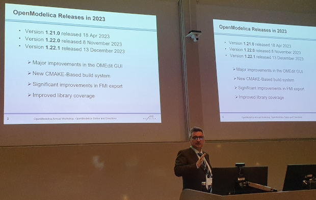
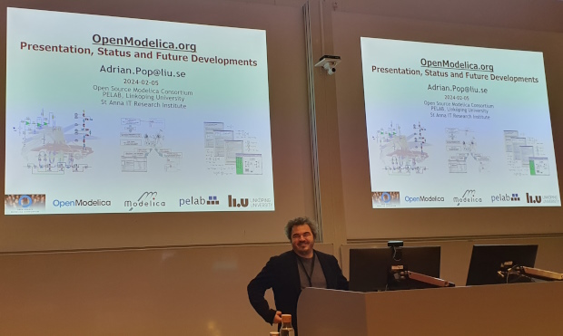

The 16th OpenModelica Annual Workshop organized by the Open Source Modelica Consortium was held successfully in Linköping, Sweden, on February 5, 2024.
Workshop chairs were Adrian Pop and Martin Sjölund.
OSMC director, Francesco Casella, presented the OpenModelica status and directions, system simulations of large energy system models.
New results and applications regarding the OpenModelica platform were presented, including modeling and simulation of large-scale models,
Model-based Balance of Operation for Carbon Capture and Storage, Modelling larger-scale district heating networks,
Technical overview of OpenModelica status, Status of the new Backend, CI/CD with OpenModelica for Library and Tool developers, integration with CRML

The program and the presentations are available [here](https://openmodelica.org/events/openmodelica-workshop/2024/)

Francesco Casella, OSMC director presents OpenModelica ongoing work and future plans.

Adrian Pop, OSMC technical coordinator and workshop chairperson, presents the current status and planned future developments of OpenModelica.
