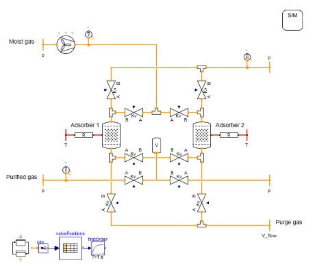

Adsorption processes are well established methods for gas separation and are becoming increasingly important for direct air capture of CO2 and air drying in battery production. These processes can be dynamically simulated using TIL Adsorption.

Summary of the technical details:
- **Adsorption equilibrium:** Various isotherm models (e.g. Langmuir, Sips or Dubinin equations) are used to model the relationship between temperature, loading of the adsorbent and partial pressure of the adsorptive.
- **Adsorption kinetics:** The adsorption kinetics are modelled within an adsorption cell consisting of a gas and an adsorbent cell.
- **Mass Transfer:** The mass transfer between gas and adsorbent cell determines whether adsorption or desorption takes place. The adsorption mass flow rate between gas and adsorbent cells is calculated using the linear driving force approach.
- **Heat Transfer:** The mixture of convective heat transfer and heat conduction between gas and adsorbent is modelled using an effective thermal resistance.
- **Calibration:** Calibration of heat and mass transfer coefficients is crucial for accurate simulation.

The [TIL Adsorption](https://tlk-energy.de/en/software/til-suite/adsorption) model library can be used to perform comprehensive plant simulations like **temperature swing adsorption**:

To learn more about the basis of modeling adsorption read the blog article:
[TIL Adsorption](https://tlk-energy.de/blog-en/simulation-adsorption-processes-modeling-basics)

Feel free to contact us for a test license at [info@tlk-energy.de](mailto:info@tlk-energy.de)