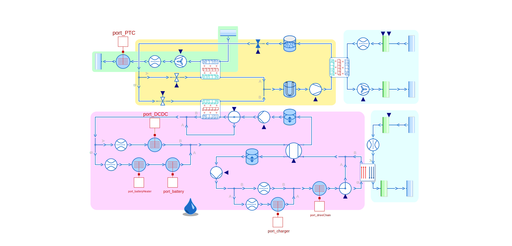

The [ThermoFluid Stream Library](https://github.com/DLR-SR/ThermofluidStream) is a free open-source library for the robust modeling and simulation of complex thermal architectures. Since winning the Modelica Library Award in 2021, it steadily grew in popularity.

For this reason, we have organized a [community event](https://github.com/DLR-SR/ThermofluidStream/blob/main/community/2024-06-19-event) on June 19 with particiants from all backgrounds: large and small companies, teachers and tool vendors.

In preparation of this event, many new contributions have been made that widen the library's application field:

#### New and upcoming Features of the DLR ThermoFluid Stream Library:

- **Static head.** Thanks to a contribution from [Saab](http://www.saabgroup.com/) components with static head pressure are now available.
	- Models for tanks and pipes using static head are now included.
	- Gravity acceleration can dynamically change during simulation.

- **New pipe models.** are added to the library thanks to a contribution from [HTWG Konstanz](https://www.htwg-konstanz.de/).
	- Models for pipes, bends, diffusors and splitters are now available.
	- Validated against Idel'chick.

- **Improved pump models.** The old pump models was a weak point of the library. There are now two new variants:
	- A very simple pumple to be intended as device for mass-flow control
	- A pump model of higher fidelity with few selected key parameters for easy specification.

- **2-phase Heat Exchanger models** especially for vapor cycles:
	- Based on models for condensation and evaporation in pipes from Baehr.
	- Validated against our own vapor cycle test rig.

-  **Interface to TIL Media.** In addition to the existin media from the MSL and XRG.
	- Customers of the [TIL Media Library](https://www.tlk-thermo.com/en/software/tilmedia-suite) can now use these excellent media models in combination with the ThermoFluid Stream.
	- The current interface solution is currently regarded as Dymola specfic.
	- Such high quality media models can lead to significant performance increase for 2-phase systems.
	
Thanks to improvements in Dymola, critical 2-phase system simulations now perform up to 3 times faster. We also pay attention to maintain compatibility to OpenModelica and other tools such as Modelon Impact.

At the community event, we have recognized that OpenModelica and the ThermoFluid Stream Library are now increasingly used for teaching Thermodynamics such as in the [examples of Peter Junglas](https://www.peter-junglas.de/fh/talks/2024-dlr/html/index.html). 

	
