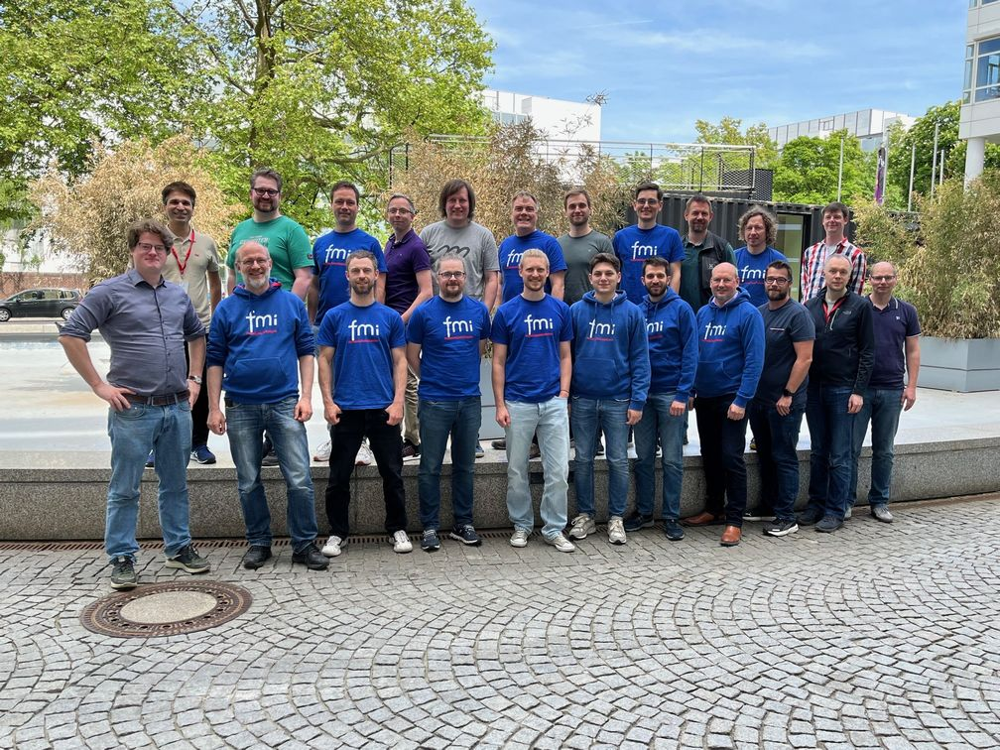

{::options parse_block_html="true" /}

#### FMI Tools List, Compatibility Information, growing FMI 3.0 support

The [FMI tools page](https://fmi-standard.org/tools/) now lists 211 tools supporting tools!

The tools listed on top and marked with the golden star now provide "compatibility information": 
They document how the tool vendors have tested their FMU import and export capabilities and standard compliance with other tools. 
Exporting tools also provide example FMUs, that can be tested by other importing tools.
This information is provided on an external webpage or repository in the responsibility of the tool vendors.

We see an acceleration in the adoption of FMI 3.0, with 41 tools already supporting it.

#### FMI Design Meeting in May 2024 in Munich

FMI developers from Altair, AVL, Bosch, Dassault Systems, dSPACE, EKS-INTEC, LTX, Modelon, PMSF, Synopsys, and Wolfram MathCore participated at the 3 day FMI Design Meeting in Munich.
Thanks to Dassault Systèmes for the great hospitality!
We made good progress, especially on layered standards to FMI 3.0:

    LS-XCP for XCP support
    LS-Bus for network communication
    LS-Struct for maps and structuring of variables
    LS-Ref for the description of basic validation experiments and other files attached to an FMU

- [FMI-LS-XCP](https://github.com/modelica/fmi-ls-xcp) for XCP support (to be released soon)
- [FMI-LS-BUS](https://github.com/modelica/fmi-ls-bus) for network communication (v1.0.0-beta.1 available)
- [FMI-LS-STRUCT](https://github.com/modelica/fmi-ls-struct) for maps and structuring of variables
- [FMI-LS-REF](https://github.com/modelica/fmi-ls-ref)  for the description of basic validation experiments and other files attached to an FMU
- Performance topics
- FMI Challenges and Self-Certification

#### Project members

After the clarification of membership in the updated [FMI Project Rules](https://fmi-standard.org/about/), many new companies and organizations joined the FMI Project, which now has the following members:

**Members of the Steering Committee:**  
AVL List, BOSCH, Dassault Systemes, dSPACE, ESI Group, Maplesoft, Modelon, PMSF, Siemens PLM, Synopsys

**Further Contributing Members:**  
Aarhus University, ABB, Altair, Akkodis, AMEPERE, Ansys, Augsburg University, Beckhoff, Boeing, Danfoss, DLR, EKS INTEC, ETAS, Fraunhofer IEM, ITK Engineering, iVH, JuliaComputing, LTX, Machineware Renault, Saab Group, Virtual Vehicle Research, Wolfram MathCore AB, TLK Thermo, tracetronic, TU Dresden _and all Steering Committee Members_

**Members of the Advisory Committee:** 
AIRBUS, blue automation, COMSOL, Fraunhofer (IIS/EAS First, SCAI), KEB Automation, NVIDIA, Knorr-Bremse Rail Vehicle Systems, Open Modelica Consortium, Samares Engineering, TWT, University of Halle, Volkswagen _and all Contributing and Steering Committee Members_

#### FMI Beginners Tutorial at the Simultech Conference 2024

There was an FMI Beginners Tutorial given at the [Simulatech Conference 2024](https://simultech.scitevents.org/) by Christian Bertsch, Cláudio Gomes, Maurizio Palmieri.
The material is available [here](https://github.com/modelica/fmi-beginners-tutorial-2024). 

You can watch a recording of the "FMI Beginners' tutorial" from the Modelica Conference 2023 in Aachen [on YouTube](https://www.youtube.com/watch?v=RlAafdCKCHU).

#### Other Resources and Discussion Forums for FMI related Questions

- Join he [LinkedIn FMI community](https://www.linkedin.com/groups/7477473/) to get the latsted news on FMI, FMI supporting tools and discussions within the user community.
- Ask technical questions and discuss topics on the usage of FMI on [Stackoverflow tagged "FMI"](https://stackoverflow.com/questions/tagged/fmi).
- Report problems of the standard itself or suggestions for new features in form of issues on on [fmi-standard.org](https://github.com/modelica/fmi-standard/issues).
