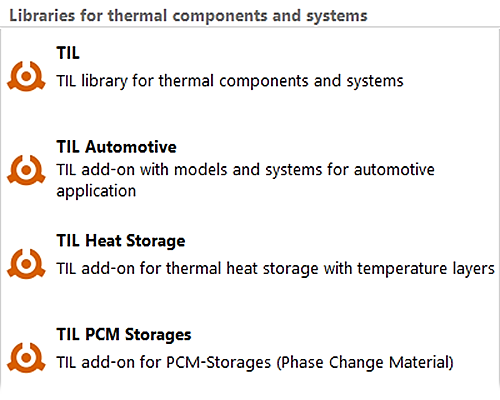

Dymola 2025x will be released on November 29, 2024.    

#### Parameter arrays
Variable-length parameter arrays makes it possible to represent lookup tables in native Modleica, without the use of C code and external objects.
Parameter arrays can be initialize at simulation initialization, not translation.
Dymola allows such arrays to fix the size hen data is read. This is also supported in FMUs generated by Dymola.

#### Parameter records
Parameter records in Modelica can be created by reading a data file in SSV or CSV format.
It is also possible to let Dymola modify an existing parameter record.
Data from the file include the name of the variable, default value, unit and description.

#### Simulation speed
Code generation for Modelica functions has been significantly improved, especially for array handing and with optimizations for constants and parameters.
Typically, this has good effect in fluid systems with many function calls for media calculations.
For example, the VaporCycle model from the **ThermofluidStreams** library runs more than 2x faster. 

#### FMI co-simulation technology
We have implemented new co-simulation technology aimed to improve performance of "heavy" FMUs with variable-step solvers.
For the right model it reduces the number of f-evaluations and Jacobian evaluations.
The fundamental idea is to smooth continuous-time Real inputs by linear interpolation during the next doStep() call.
This means the numeric integrator can continue without costly resets, leading to larger step-size and fewer evaluations.
Furthermore, a predictor compensation gives better error estimates. 

#### TIL-Suite libraries
The existing ThermalSystems library is replaced by TIL-Suite from TLK-Thermo.
This change will offer more complete range of libraries and extended functionality.
It is divided into four library products at Dassault Systèmes:
-	TIL Base Library
-	TIL Mobile Air Conditioning Library
-	TIL Hydrogen Library
-	TIL Thermal Storages Library

There is a free upgrade for existing customers of ThermalSystems to TIL Mobile Air Conditioning Library.

#### Dymola Modelica Compiler
For toolchain integrators we now present the most minimalistic version of Dymola ever, the Dymola Modelica Compiler (DMC).
It is a command-line tool that can translate models, export FMUs, simulate and run mos-scripts.
DMC requires the usual Dymola license.
