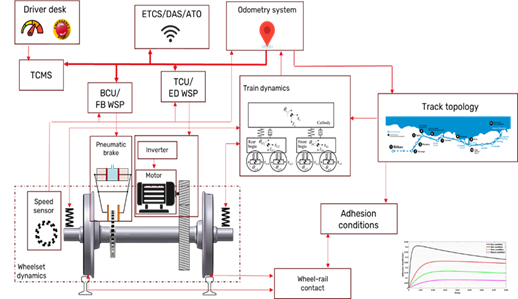

The project [`FP1-MOTIONAL`](https://projects.rail-research.europa.eu/eurail-fp1/), implemented by Europe’s Rail Joint Undertaking ([`EU Rail`](https://rail-research.europa.eu/)) and running from 2022-2026, addresses digitalization and data exploitation as a transversal topic essential for many innovation fields in railways such as automation, asset management, operational optimization and new sustainable rail system and service solutions.
 
The Work Stream 2 of the project aims at organizing in particular the modularity, interoperability and composability of the complex high-order digital twins. The figure below, provided by the partner [`CAF`](https://www.cafmobility.com/),  exemplifies a system architecture currently under consideration to implement a digital twin for braking and traction.

The [`Functional Mock-up Interface`](https://fmi-standard.org/) has been selected as the standard exchange format for model components to enable the reuse of existing models and tools and to allow  IP-Protection of model content from commercial suppliers. Special attention in the use case driven work is given to a proper design of interfaces, i.e. the in- and output quantities of component FMUs. It is the goal to deliver a range of digital twin assembly templates similar to the [`Vehicle Interfaces Library`](https://github.com/modelica/VehicleInterfaces) in the automotive field. In order to prepare the future business case, the digital twins will be  compliant and  integrated into in the data ecosystem called [`Rail Data Space`](https://internationaldataspaces.org/usecases/european-rail-data-space/), also addressed within [`FP1-MOTIONAL`](https://projects.rail-research.europa.eu/eurail-fp1/).

The authors would like to acknowledge the funding from the Horizon Europe programme under grant agreement No. 101101973 — FP1 - MOTIONAL — HORIZON-ER-JU-2022-01.

**Your feedback is very welcome!**