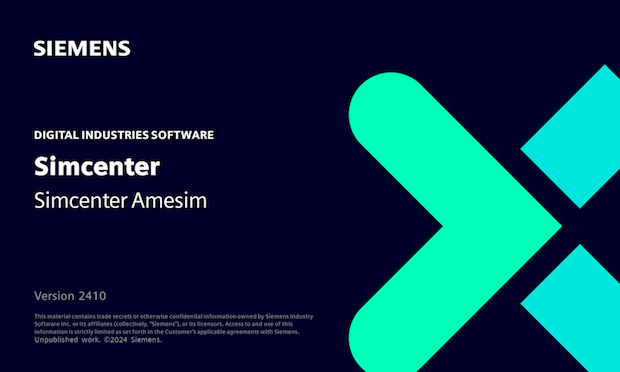
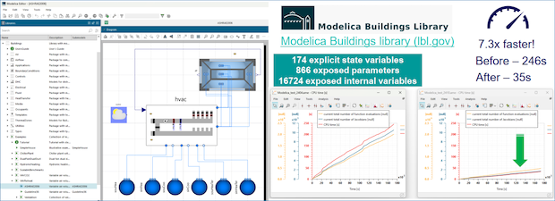

[Siemens Digital Industries Software](https://www.sw.siemens.com/ ) is pleased to announce the recent release of **Simcenter&nbsp;Amesim&nbsp;2410** as part of its [system simulation solutions]( https://blogs.sw.siemens.com/simcenter/whats-new-in-simcenter-systems-simulation-2410/). This release brings remarkable performance improvements to the solver and code generation that combine well with previous optimizations such as those related to so-called &ldquo;0-flow&rdquo; problems or to discontinuity handling in a co-simulation context. These improvements have a positive impact on the support of FMI and Modelica.

## Accelerated simulations
While the original aim was to speed up the simulation of Pseudo-Two-Dimensional (P2D) battery models 
&mdash;&nbsp;achieved with a speedup factor of about&nbsp;9 compared to release 2404&nbsp;&mdash;, two *generic* solver enhancements 
have been implemented which have tangible positive consequences on all kinds of &ldquo;large&rdquo; 
models, including native models but also Modelica models and imported Model Exchange FMUs, as soon as the &mdash;&nbsp;default&nbsp;&mdash; variable step solver is selected. These enhancements, activated by default, are:

* A new heuristic for optimized calculations of Jacobian matrices,
* An optimized handling of sparse linear systems.

&ldquo;Large&rdquo; models are a strong trend even for system simulation, for example to serve electrification. They typically involve fine-grained spatial discretizations, numerous inputs/outputs, state variables, internal variables and/or parameters. 

## Improved code generation for Modelica and imported FMUs
On top of that, the code generation performed when creating a Modelica 
model, importing an FMU, a pre-trained neural network ([ONNX](https://onnx.ai/ ) file) or a response surface, 
has been upgraded to &ldquo;V2&rdquo;, featuring lightweight and more CPU-efficient code. 
For Modelica and FMI, the 
outcome is a more robust coupled simulation with &ldquo;large&rdquo; models. For highly-hierachical Modelica
models, this results in compilation and simulation times that compete with 100% Modelica-based tools,
for example with models coming from Lawrence Berkeley's open-source [Buildings Library v11.0.0](https://simulationresearch.lbl.gov/modelica/ ). 

## Fast-running exported co-simulation FMUs
Obviously, the above-mentioned solver improvements for native or hybridized models are automatically reflected&nbsp;&mdash;&nbsp;*embedded*&nbsp;&mdash;&nbsp; in exported FMUs for co-simulation, for the deployment of performant *plant models*. Combined with the optimized discontinuity handling introduced in release 2304, the speedup is further maximized in this context since at each co-simulation *rendez-vous* point, the solver's current pace is kept unchanged whenever possible. 
This strategy is effective independently of the chosen import tool. A typical use case is when the **Simcenter&nbsp;Amesim** FMU is connected to a controller model whose outputs may have changed little or not at all during a co-simulation time step. 

For more information on **Simcenter&nbsp;Amesim**, please visit our [website](https://www.plm.automation.siemens.com/global/en/products/simcenter/simcenter-amesim.html ).
