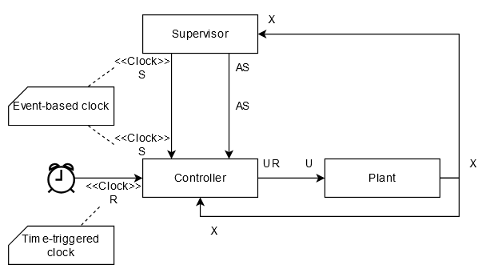
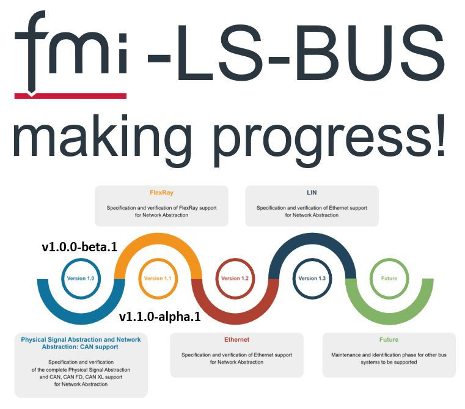
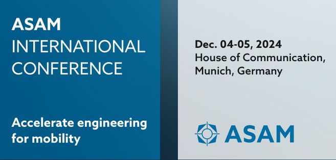

{::options parse_block_html="true" /}

#### First FMI Advisory Committee meetting

After the clarification of FMI Project membership roles, the and Project hosted the first FMI Advisory Committee meeting on Nov 5th 2025.
 We received very valuable feedback, ideas and feature requests!
Thanks to the 70 participants for their contributions and participation!
(Participating Companies: Akkodis, Ansys, AVL, Beckhoff, Boeing, Bosch, Claytex, COMSOL, DassaultSystems, dSPACE, EKSINTEC, GMMotorsports, KEB, KnorrBremse, LBL, LTX, MachineWare, MapleSoft, Mathworks, ModelbasedCloud, Modelon, NVIDIA, PMSF, PrincipiaMBS, Renault, SamaresEngineering, Siemens, Synopsys, Volkswagen, VolvoAutonomousSolutions)

Some of the topics that were discussed: 

* Support for new targets such as aarch64-linux in FMI 2.0 (already possible in FMI 2.0.4)
* Security aspects in the exchange of FMUs
* Memory safety requirements for FMUs
* Increase visibility of FMI in the US
* Improve recommendations on the use of FMU checkers (https://fmi-standard.org/validation/) 
* Using of FMI for optimization, enhance support for partial derivatives
* Improve parameterization of FMUs
* Interoperability of Open-USD and FMI
* GPU support of FMUs (especially efficient data exchange)

These will be discussed in more detail in the FMI design group, and actions will be derived. Stay tuned!

#### Maintenance releases FMI 3.0.2 and FMI 2.0.5: release process ongoing

The FMI project is preparing for maintenance releases FMI 2.0.5 and FMI 3.0.2.
Currently an inspection period is running for the release candidates, which you can find here together with a summary of changes: https://github.com/modelica/fmi-standard/releases
In case of any findings, please open an issue https://github.com/modelica/fmi-standard/issues a.s.a.p.!

#### Examples of SynchronousClocked FMUs available

As more and more modelling and simulation tools extend their support for FMI 3.0, now advanced features such as synchronous clocks get more into the focus. 
Thanks to Cláudio Gomes for providing a very instructive example with several FMUs on Github (https://github.com/clagms/synchronous-clock-fmus), that can be used to understand the concept and validate the synchronous clock support in importing tools. 
Already successfully tested in Altair Activate by Masoud Najafi (Thanks!).

#### FMI Layered Standard for for Network Communication (FMI-LS-BUS) 

The version v1.0.0 for CAN, CAN FD, CAN XL is in beta testing currently, and will be demonstrated at the International ASAM Conference in Munich in December.
And in parallel we made progress on the Flexray support and are happy that we could tag v1.1.0alpha.
Thanks to all contributors! Stay tuned!

#### FMI Design Face2Face Meeting in Munich Dec 2-3 2024

AVL will host a face-2-face in Munich at the beginning of December.
We will work on layered standards to the FMI standard and future improvements.

#### ASAM Conference in Munich Dec 4-5 2024

The FMI Project will present "FMI, Layered Standards and ASAM Standards - Enabling Seamless SiL Simulation of Virtual ECUs" at the coming International ASAM Conference in Munich. 
You can meet us also at the Modelica Association booth there!

We present three new layered standards for simulating virtual ECUs with FMI 3.0:
- FMI-LS-XCP for measurement & calibration with XCP: https://github.com/modelica/fmi-ls-xcp
- FMI-LS-BUS for simulation of network communication with CAN (FD, XL), FlexRay, Ethernet, LIN: https://github.com/modelica/fmi-ls-bus
- FMI-LS-STRUCT for structured entities like lookup tables: https://github.com/modelica/fmi-ls-struct

A demo from tool vendors (Akkodis, Altair, AVL, Bosch, dSPACE, PMSF, SYNOPSYS) illustrates the interoperability of these layered standards.

Looking forward to meet you in Munich!
More information on the conference: https://www.asam.net/conferences-events/detail/asam-international-conference-2024/

#### 16th Internation Modelica and _FMI_ Conference!

We are are happy to invite you to the coming https://modelica.org/events/modelica2025/, where the importance of FMI is now also reflected in the conference title!

#### Other Resources and Discussion Forums for FMI related Questions

* Join the [LinkedIn FMI community](https://www.linkedin.com/groups/7477473/) to get the latest news on FMI, FMI supporting tools and discussions within the user community.
* Ask technical questions and discuss topics on the usage of FMI on [Stackoverflow tagged "FMI"](https://stackoverflow.com/questions/tagged/fmi).
* Report problems of the standard itself or suggestions for new features in form of issues on [fmi-standard.org](https://github.com/modelica/fmi-standard/issues).
