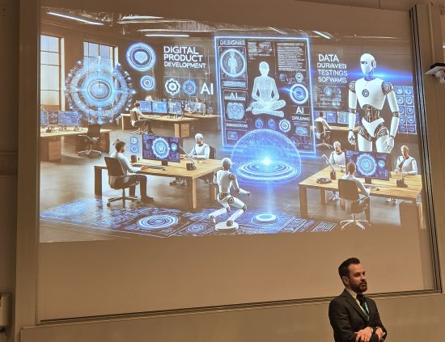
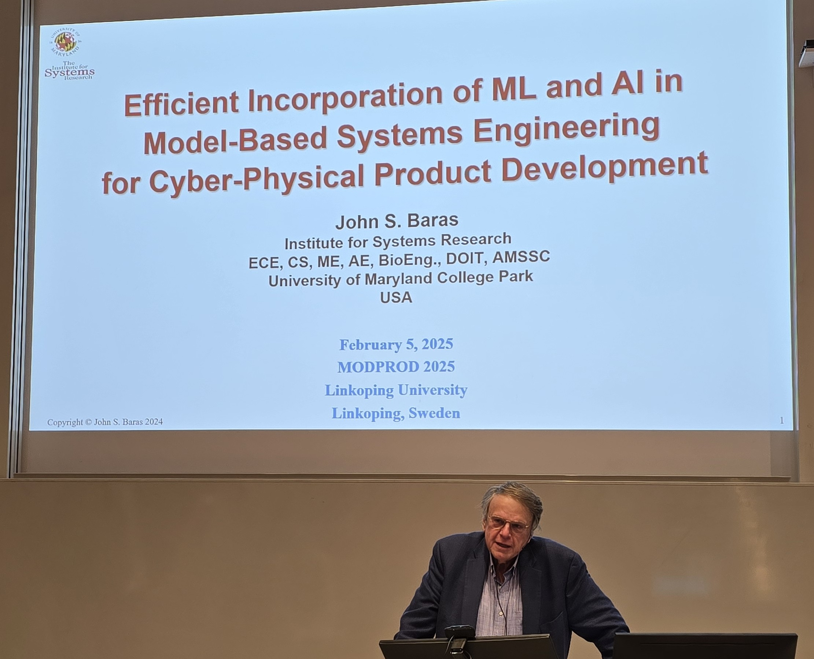
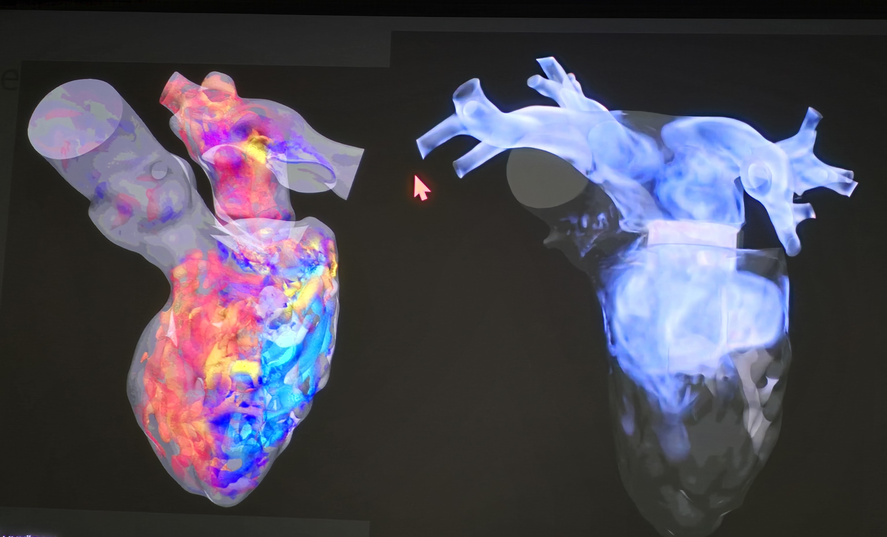

The 19th international MODPROD Workshop on Model-Based Cyber-Physical Product Development, organized by the MODPROD competence center at Linköping University, was successfully held at Linköping University, Linköping, Sweden, February 4-5, 2025.

Four very interesting keynotes were presented:

1. Per-Olof Marklund, Head of Technology and Innovation, Saab Aeronautics
   "Digital Engineering at Saab – history and future"

2. Prof. Manuel Wimmer, Johannes Kepler University Linz
   "Model-Driven Engineering of Digital Twins"

3. Prof. John Baras, University of Maryland College Park, USA
   "Efficient Incorporation of ML and AI in Model-Based Systems Engineering for Cyber-Physical Product Development"

4. Dr. Mattias Tiger, Deputy leader of Reasoning and Learning Lab, Linköping University
   "Overview of AI Modeling Challenges in Preparing Robots for the Real World"

Dr Robert Braun, Chairperson, opens the workshop. The background is a Chat GPT AI generated picture related to the topics of the workshop.

Prof. John Baras, presents his keynote on Machine Learning and AI in Model-based sysems engineering.

In the evening the first day we had a real hightlight, a study visit to CMIV – The Center for Medical Image Science and Visualization at Linköping University. An extremeley interesting presentation was made by Anders Persson, professor and director of the center. Amazing visualizations and simulations were presented.

A visualization of dynamic flows in a human heart, presented at the CMIV center.

The program and (soon) the presentations are available from www.modprod.liu.se