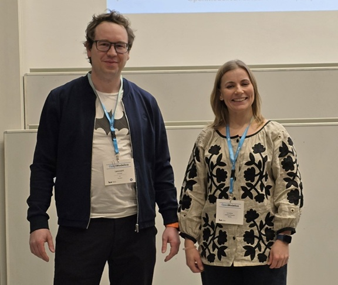
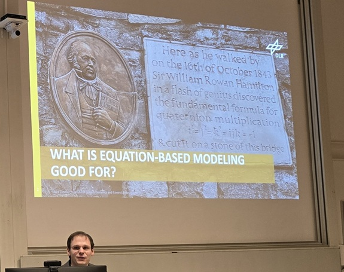
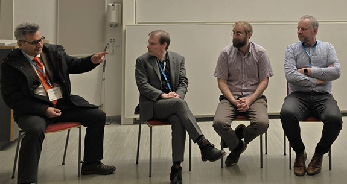

The 17th OpenModelica Annual Workshop organized by the Open Source Modelica Consortium was held successfully in Linköping, Sweden, on February 3, 2023.

Workshop chairs were Lena Buffoni and Lennart Ochel.

New results and applications regarding the OpenModelica platform were presented, including Status and directions of OpenModelica, a keynote about Modelica Lite -  Towards a Strict, Robust and Scalable Subset of Modelica, Highlights of the latest OMSimulator, Status and Development of the new Backend, An Open-Source Exercise Package for Electric Power System Teaching using the Dynawo Modelica Library, Experience with Google Colab for running Modelica FMU in notebooks and no installation, Newton Diagnostics: a new handy tool for failing initialization debugging, An Open-Source Implementation of WECC Battery Energy Storage Systems Models for Power System Stability Studies, Current Status and Technical Overview of OpenModelica and its Development Environment, Extending Direct Collocation-Based Dynamic Optimization with Adaptive Mesh Refinement, NeuralNetwork 3.0: A Library for representing PeNODEs in Modelica, Automatic Layout Generation and Translation of System Dynamic Models, Dynamics of mechanical press, Optimization of Ethanolamines Production with OpenModelica & CasADi, AESE Library Developed in OpenModelica: Simulation and Research for Nuclear Power Systems, Panel on Future Directions of OpenModelica.

The program and the presentations are available [here](https://openmodelica.org/events/openmodelica-workshop/2025/)

Lennart Ochel and Lena Buffoni, Chairpersons, opened the workshop and were leading the panel discussion.

Dirk Zimmer, Chairman of Modelica Association, gave an interesting keynote “Modelica Lite - Towards a Strict, Robust and Scalable Subset of Modelica”

Panel discussion on the future of OpenModelica. From left:  Francesco Casella, Dirk Zimmer, Robert Hällqvist,  Lars Eriksson