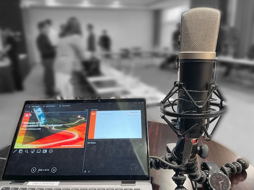

--
title: SimulationX User Conference 2024 – On-Demand Access Now Available
author: "Majid Aziz ([ESI KeySight](https://www.esi-group.com/))"
category: "vendor"
---

The **SimulationX User Conference 2024** brought together experts from automotive, aerospace, energy, and industrial sectors to explore the latest advancements in system simulation. Keynote sessions included insights from Prof. Dr.-Ing. Guenther Prokop (TU Dresden) on cyberphysical prototyping and Tata Motors on sustainable transmission validation. Presentations from IAV GmbH, JAXA, Daimler Truck AG, and INNOMOTICS covered topics such as NVH analysis in EVs, digital twin applications, and multibody system modeling for trucks.   

Don't miss this opportunity to gain valuable insights—watch the sessions [on-demand here](https://www.esi-group.com/events/2024/simulationx-user-conference-2024-hybrid-edition).

Additionally, a special Tutorial Day on scripting in SimulationX with Python, efficiency tips, and inverse kinematics is [available on request](mailto:mns@esi-group.com).
