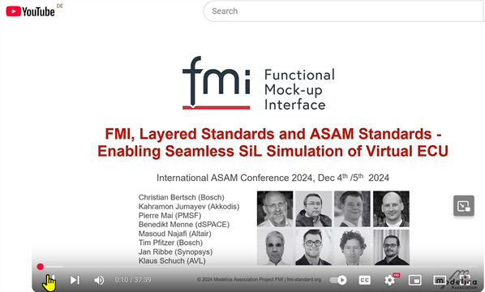
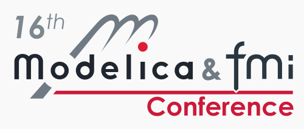

{::options parse_block_html="true" /}

### Maintenance releases FMI 3.0.2 and FMI 2.0.5 available

Two maintenance releases FMI 2.0.5 and FMI 3.0.2 have been released end of 2024 with clarifications and bugfixes and no new features compared to FMI 2.0.4 and FMI 3.0.1 respectively. 
FMUs created according to FMI 3.0.2 are valid FMUs according to FMI 3.0 and FMI 3.0.1 and vice versa. The good news is, that FMI 2 and 3 are actively maintained, and no serious bugs have been found in the FMI 3.0 specification yet, even though FMI 3.0 features are more and more used!

All releases are available on the [FMI website](fmi-standard.org). For a detailed list of changes see the [releases page on GitHub](https://github.com/modelica/fmi-standard/releases).

#### Layered standards (pre-)releases by the FMI Project

The FMI Project is proud to announce the progress in the definition of layered standards on top of the FMI standard! (Layered standards are extentions to the core FMI standard for special applications.)

* [FMI-LS-XCP](https://github.com/modelica/fmi-ls-xcp) v1.0.0 released: This layered standard defines support for [XCP](https://www.asam.net/standards/detail/mcd-1-xcp/) or “Universal Measurement and Calibration Protocol”, a network protocol defined by [ASAM](https://www.asam.net/). This is the first layered standard on top of the FMI Standard released by the FMI Project!
* [FMI-LS-BUS](https://github.com/modelica/fmi-ls-bus) v1.0.0-rc.1 release candidate: This layered standard defines how to realize the simulation of network communication with FMI 3.0 means.
* [FMI-LS-STRUCT](https://github.com/modelica/fmi-ls-struct) v1.0.0-alpha.1 prerelease: Based on FMI 3.0, this layered standard defines how variables (especially parameters) of an FMU can be structured and grouped in a more flexible way than with the “structured naming convention” of the FMI Standard. The first version of this layered standard is focused on the definition of sampled maps.

Another layered standard, [FMI-LS-REF](https://github.com/modelica/fmi-ls-ref) is in an earlier development stage. It will allow for the inclusion of related files into an FMU. This includes parameter sets, reference stimuli and results, which can be used in additional experiments, as well as other relevant files to the FMU, like the model sources, requirements, or specifications.

#### Slides and recording of our presentation at the ASAM Conference 2024 available

Representatives from the FMI Project presented "The Functional Mock-up Interface (FMI), Layered Standards and ASAM standards - Enabling Seamless SiL Simulation of V-ECUs" at the International ASAM Conference 2025 in Munich.
The three new layered standards mentioned in the paragraph above were used for simulating virtual ECUs with FMI 3.0 means. A demo from tool vendors Akkodis, Altair, AVL, Bosch, dSPACE, PMSF and SYNOPSYS  illustrates the interoperability of these layered standards.

The slides are available [on the FMI website](https://fmi-standard.org/assets/literature/FMI-LS-ASAM_2024.pdf), and the video is available [on Youtube](https://www.youtube.com/watch?v=KzzKRa3jORs).

#### 16th Internation Modelica and _FMI_ Conference Sept 8-10 2025 in Lucerne, Switzerland

We are are happy to invite you to the coming [16th International Modelica & FMI Conference](https://modelica.org/events/modelica2025/) in Lucerne, where the importance of FMI is now also reflected in the conference title!

We will make sure, that this will be the most attractive conference also for participants mainly interested in FMI by creating a program where you can select sessions focused on FMI from the beginning to the end of the conference by providing

- tutorials on FMI
- keynotes with a general scope
- scientific sessions on FMI
- industrial user sessions on FMI
- Modelica-related sessions that also involve the usage of FMI
- sessions on FMI's "sister" standards SSP, eFMI, DCP

Looking forward to meet you in Lucerne!

#### FMI Advisory Committee meetings

Besides the FMI Steering Committee members and Contributing members (see [here](https://fmi-standard.org/about/)), the FMI Advisory committee consist of the the following companies: AIRBUS, blue automation, Claytex, COMSOL, DNV, Fraunhofer (IIS/EAS First, SCAI), GM Motorsports, KEB Automation, LBL, NVIDIA, Knorr-Bremse Rail Vehicle Systems, MathWorks, Open Modelica Consortium, Samares Engineering, SINTEF Nordvest, University of Halle, Volkswagen, Volvo Autonomous Solutions, VTI.

After a very successful first advisory committee meeting on Nov 5th 2025, we have scheduled two more Advisory committee meetings: 

- a Webmeeting on April 29th
- an in-person-meeting the day after the Modelica Conference in Lucerne. Meet the FMI community!

If you have a topic suggestion, want to join as a guest, or want to apply for membership in the FMI Advisory Committee, please contact contact@fmi-standard.org.

#### Other Resources and Discussion Forums for FMI-related Questions

* Visit the [FMI tools page](https://fmi-standard.org/tools) listing 230+ tools supporting FMI!
* Join the [LinkedIn FMI community](https://www.linkedin.com/groups/7477473/) to get the latest news on FMI, FMI supporting tools and discussions within the user community.
* Ask technical questions and discuss topics on the usage of FMI on [StackOverflow tagged "FMI"](https://stackoverflow.com/questions/tagged/fmi).
* Report problems of the standard itself or suggestions for new features in form of issues or discussions on [fmi-standard.org](https://github.com/modelica/fmi-standard)
