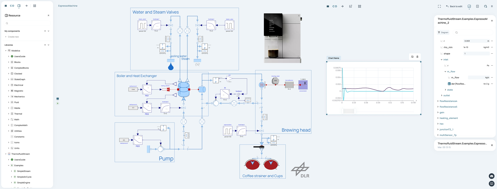
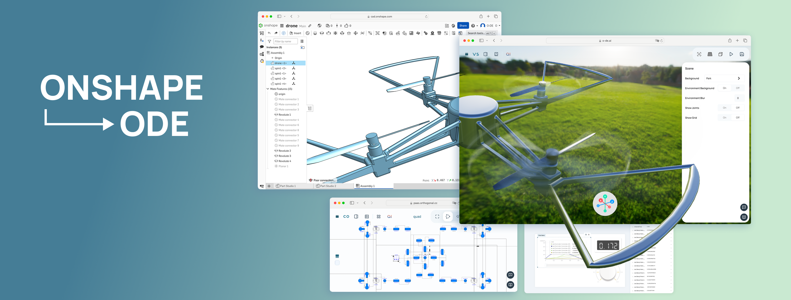
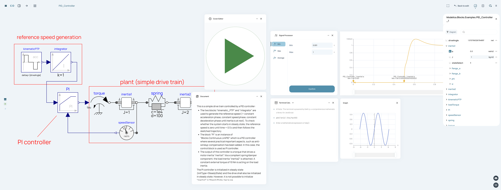

  

**Web-native Simulation Environment** Orthogonal Supersystems, a Munich-based high-tech startup, unveils ODE, a web-native Advanced Modelica Simulation Platform. This state-of-the-art environment fully supports MSL 4.0 and integrates widely adopted Modelica libraries, such as DLR's Thermofluid Stream, Chemical, Buildings, and so on. Delivering desktop-grade performance, it pairs powerful simulation capabilities with the flexibility of cloud access and effortless mobile compatibility.

**Advanced Model-Based Application Tools** ODE features robust model-based application tools, including System Assembler for constructing SSP systems with FMU integration, sophisticated 3D visualization that connects directly to Onshape CAD systems, and interactive components enabling real-time simulation.

**Enhanced User Experience** A suite of intuitive widgets streamlines modeling and simulation tasks, featuring a sleek cover editor, a versatile documentation editor, and a robust mathematical calculator with command-line capabilities for advanced matrix operations and scientific visualization.

**Design-Driven Philosophy** The platform's reimagined minimalist user interface reflects Orthogonal's design-driven approach, eliminating unnecessary complexity while ensuring intuitive usability. Built on a future-ready software architecture, ODE's roadmap includes upcoming features such as team collaboration capabilities, AI integration, and expanded third-party tools connectivity.
