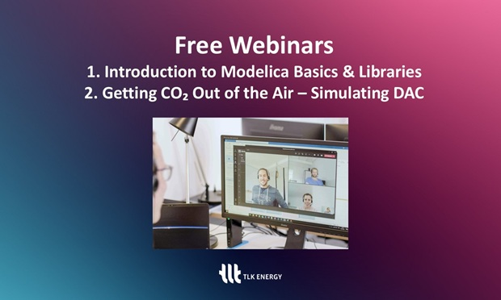

--- 
title: Join TLK Energy’s Free Webinars on Modelica and CO₂ Capture
author: "Lina Rosenthal ([TLK Energy GmbH](https://tlk-energy.de))"
category: "vendor"
---

TLK Energy recently marked its 10th anniversary. Over the past decade, the company has been shaped by a strong commitment to system modeling with Modelica, guided by the open-source mindset and collaborative approach of the Modelica community. These values continue to drive TLK Energy’s work and knowledge-sharing efforts. 

As part of this, TLK Energy is hosting two free webinars on system modeling and simulation: 

#### Upcoming Webinars 
**Introduction to Modelica Basics and Our Model Libraries**
This session is designed for those new to Modelica or interested in exploring TLK’s model libraries. It will also feature demonstrations of TIL running in different simulation environments, including Dymola and Modelon Impact. 

**Date**: May 13    **Time**: 3:00 PM

[More Info & Registration](https://events.teams.microsoft.com/event/ca0e19f2-34a2-4473-bfa7-ff038d33cb19@6c7be5ac-e3a9-45bc-aea9-1adeda11876c)

**Capture More CO₂ from the Air – Simulation-Based Design of Direct Air Capture Processes**
(in collaboration with 3P Instruments)
This webinar will focus on adsorption processes in direct air capture applications and how TIL Adsorption can contribute to optimizing these processes. It will also cover the role of measurement data in improving simulations.

**Date**: May 15    **Time**: 3:00 PM

[More Info & Registration](https://events.teams.microsoft.com/event/a7ded36f-8bdb-432b-9669-39a8632cc1db@6c7be5ac-e3a9-45bc-aea9-1adeda11876c)

Both webinars offer an opportunity to exchange knowledge and discuss system modeling approaches with others in the field. 