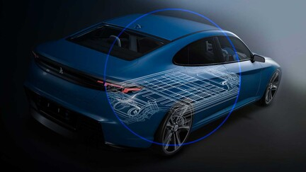

Watch the ([replay](https://events.3ds.com/catia-sustainable-energy-systems)) of Dassault Systemes' System Simulation Team exploring sustainable energy solutions, from design to integration, and learn how to optimize costs while ensuring compliance with environmental standards.

#### Agenda
- Introduction
- Use Case 1: Smart Energy Home
- Use Case 2: Rail Freight
- Use Case 3: Mining
- Conclusion
