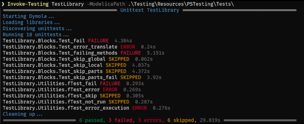

The Testing library now includes the PowerShell module PSTesting,
which enables easy test execution on Gitlab, Jenkins and in local sessions.

Moreover, the library will be presented at two events in September:
In an interactive tutorial at the Modelica Conference and
as a live stream in the CATIA Masterclass series.

#### PowerShell Module: PSTesting

PSTesting is shipped with the Testing library in Dymola 2025x Refresh 1.



Usage is simple. Install PowerShell 7.5, import the module and run commands like:
```
Invoke-Testing unittest MyLibrary -JunitXml report/junit.xml 
```
This will start the latest Dymola version in the background,
simulate all tests, print the results and create a junit.xml.

We can also check libraries, simulate examples and configure many options.
The Testing user's guide and the PSTesting documentation provide all infos you need.

#### Upcoming Events

**Tutorial: Regression Testing with Dymola and the Testing Library**

- Location: At the Modelica Conference in Lucerne
- Time: Monday, 08/Sep/2025, 1:30pm - 4:45pm
- Check the [Tutorial Abstract Booklet](https://modelica.org/events/modelica2025/Tutorial_Abstracts_16th_Modelica_and_FMI_Conference.pdf)
for details.

**CATIA Masterclass: Automated Tests in Modelica with Dymola and the Testing Library**

- Location: Live-Stream on LinkedIn and in the [CATIA MBSE Cyber Systems](https://r1132100503382-eu1-3dswym.3dexperience.3ds.com/community/swym:prd:R1132100503382:community:4GJPS8QmTuC4wF8BSLitkw) community.
- Time: Thursday, 18/Sep/2025, 3:00pm, 45min + questions  
- The replay will be available on YouTube.
