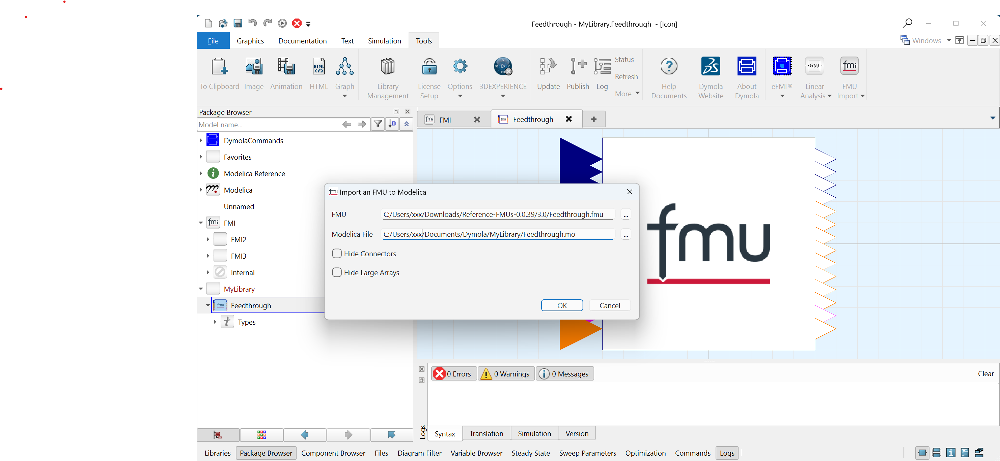

## Modelica FMI

We are happy to annouce the release of a generic Modelica library to import [Functional Mock-up Units](https://fmi-standard.org/).

## Highlights

- supports FMI 2.0 and FMI 3.0 for Co-Simulation
- works with all Modelica tools
- logs FMI calls to the console or to a file

See https://github.com/modelica/Modelica-FMI for more information.
