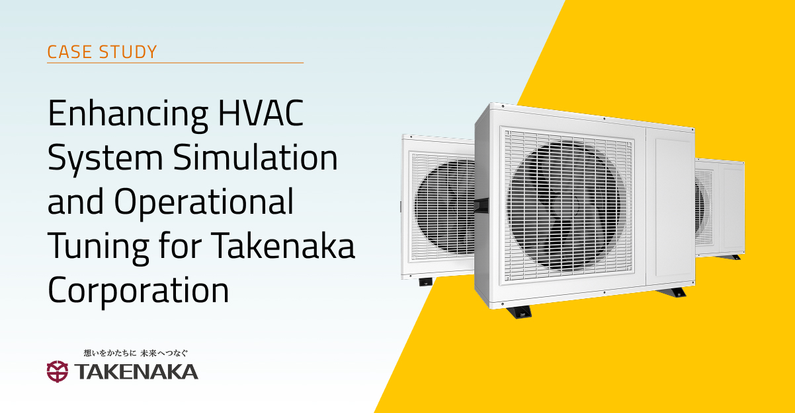

#### Modelon Sponsors the International Modelica Conference 

We’re happy to announce that Modelon will be a Gold Sponsor at the upcoming International Modelica Conference in Lucerne, Switzerland, September 8-10, 2025. We look forward to meeting a large part of the Modelica community in person. Modelon will present the below sessions: 
- **Tutorial Session:** Beyond Simulation – Building Workflows and Web Applications with Modelica and Python
  - In this hands-on session, attendees will learn how to integrate Python with Modelica to automate tasks, visualize results, and build interactive interfaces – all within [Modelon Impact.](https://modelon.com/modelon-impact/)
- **Vendor Session:** What’s New in Modelon Impact – AI-Powered Modeling, Seamless Collaboration, and Expanded Integration
  - Come see the latest and greatest Modelica-powered system simulation technology that Modelon Impact has to offer. Attendees will get an exclusive first look at our AI-powered code editor as well as more game-changing features.
- **Technical Paper Session:** _Frost/Defrost Models for Air-Source Heat Pumps with Retained Water Refreezing Considered_ presented by Matthis Thorade

Modelon will also have a booth in the exhibition hall. We hope to see you there in just a few months!  

#### Modelica Buildings Library Now Available in Modelon Impact 

Modelon is happy to announce that the Modelica Buildings Library is included and fully supported in Modelon Impact. This integration creates new possibilities for engineers and researchers working to improve building performance, enabling scalable modeling and simulation within a modern, collaborative environment. 

[Read the full announcement here.](https://modelon.com/blog/modelica-buildings-library-now-in-modelon-impact/)

#### Introducing Modelon Help Center and Community

We’re excited to announce the upcoming launch of the Modelon Help Center and Community — a dedicated space for the global Modelica community to connect, share ideas, and support one another. 

Whether you're a researcher, system simulation expert, or just passionate about Modelica, this is your place to explore best practices, ask questions, and collaborate on both academic and commercial applications. 

We’re currently opening access to a small group of early users. Want in? 
[Join the waitlist by adding your email here.](https://modelon.com/community-coming-soon/) 

#### New Case Study: Enhancing HVAC System Simulation and Operational Tuning for Takenaka Corporation 

To bridge the gap between HVAC system design and real-world performance, Takenaka Corporation—one of Japan’s leading engineering contractors—partnered with Modelon. Leveraging Modelon Impact’s physics-based modeling and seamless integration with EnergyPlus, Takenaka developed a high-fidelity HVAC system simulation for a standard office floor. This enabled more accurate control logic tuning, operational optimization, and laid the groundwork for future modeling of larger buildings. The collaboration not only improved energy performance but also strengthened Takenaka’s internal simulation capabilities, supporting their long-term vision for energy-efficient, comfortable Net Zero Energy Buildings (ZEBs).

[Read the full case study here.](https://modelon.com/support/hvac-system-simulation-takenaka-corporation/)
