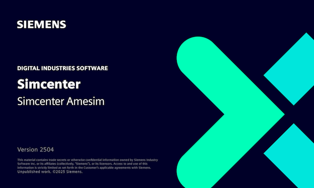
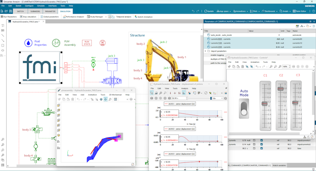

#### Simcenter Amesim 2504 released
[Siemens Digital Industries Software](https://www.sw.siemens.com/) is pleased to announce the recent release of **Simcenter Amesim 2504** as part of its [system simulation solutions](https://blogs.sw.siemens.com/simcenter/whats-new-in-simcenter-systems-2504/). This release introduces key updates including further more accelerated simulations and improved model validation tools. Enhancements target electrification with new battery and heat exchanger assistants, electrochemical aging simulations, and hydrogen applications with components for electrolyzer and cryogenic storage modeling. It also supports the import of 3.0 Functional Mockup Units (FMUs) for co-simulation, as described hereafter.

#### Import of 3.0 FMUs for co-simulation
To further extend the capabilities of **Simcenter Amesim** as heterogeneous model integration platform, the import of 3.0 FMUs for co-simulation has been implemented. 
Fixed-size FMI 3.0 *arrays* are supported as well as *tunable* elements/parameters. Expected benefits for users are:

* A direct import of virtual ECUs, typically with arrays.
* The capability to orchestrate multiple 3.0 and 2.0 FMUs within the same model, while using distinct run settings for each FMU.

Test FMUs from Simulink, Dymola, Twin Activate, MapleSim and other tools have been successfully imported and simulated during the implementation phase.
The below picture shows an example of 3.0 FMU imported to a real-time capable **Simcenter Amesim** hydraulic excavator model, whose execution is synchronized with the wall clock time.
The FMU comes from Simulink R2025a. It features an FMI array output represented by a vector, as well as tunable parameters, allowing to change the value of this vector. These tunable parameters are used to control the excavator.

#### Upcoming event: 16th International Modelica & FMI Conference
**Karim Besbes**, from [Siemens Digital Industries Software](https://www.sw.siemens.com/), is going to present a paper entitled: "An innovative heterogeneous modeling approach to build a cooling system for battery thermal management with common fluid properties involving FMI terminals".
This work, which proposes a promising technique for sharing media properties between tools, which is still an interoperability challenge at the present time, demonstrates Siemens' willingness to contribute to both FMI and Modelica to offer the best to its customers. Check out the Tuesday afternoon session on the conference's [preliminary program](https://modelica.org/events/modelica2025/16thModelicaFMI_PrelProgram.pdf).

For more information on **Simcenter Amesim**, please visit our [website](https://www.plm.automation.siemens.com/global/en/products/simcenter/simcenter-amesim.html ).

