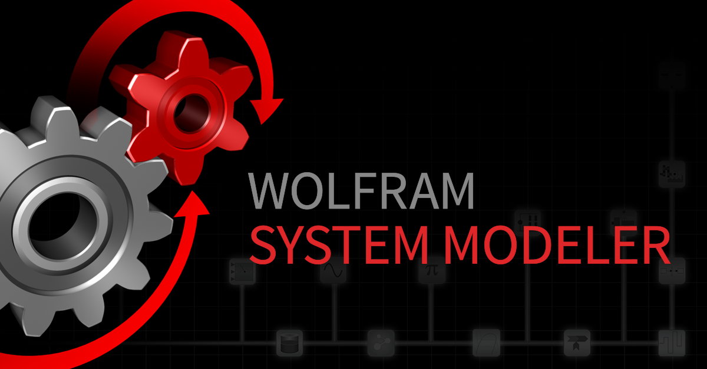

The upcoming release of System Modeler 14.3 brings powerful new features for users who want more than just modeling. Whether working within the System Modeler interface or leveraging the full power of Wolfram Language, you get flexible tools for post-processing, analysis, and visualization. Here are some highlights:

- *Automated Design Validation*: Define high-level performance and safety requirements and automatically verify them—powered by Wolfram Language.
- *Live Tuning During Simulation*: Modify gains, time constants, or other parameters on the fly—without stopping or recompiling your model.
- *Simulate Using Calendar Time*: Set simulation periods using real-world dates and generate time-aware plots for clearer, more contextual insights.

Stay tuned—System Modeler 14.3 is just around the corner! A full feature list will be available at [wolfram.com/system-modeler](https://www.wolfram.com/system-modeler/) upon release.
