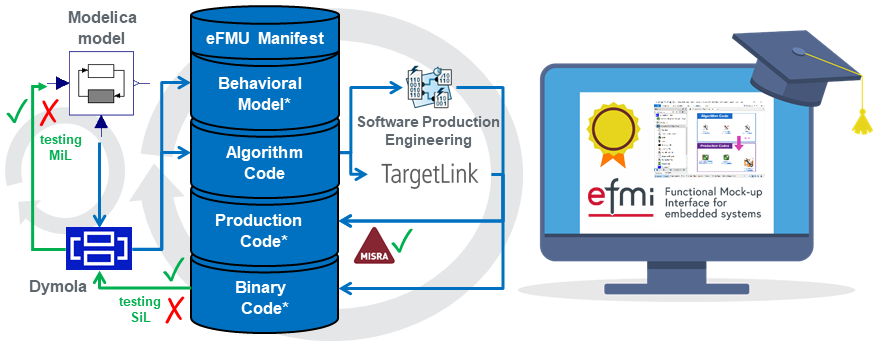

{:width="620px"}

**Time:** Monday, 08/Sep/2025, 1:30pm--4:45pm (including 30min coffee break)

We are happy to announce that there will be an extensive [eFMI®](https://www.efmi-standard.org/) tutorial at the upcoming [16th International Modelica & FMI Conference](https://modelica.org/events/modelica2025/).

The tutorial will demonstrate the current state-of-the-art of available eFMI® tooling. Participants will get a very high-level overview of the eFMI® workflow from acausal physics models in Modelica® down to embedded target code and a _hands-on_ experience of it for selected Modelica® examples. The generated eFMUs and their various intermediate model representations are investigated, focusing on the non-functional quality criteria satisfied by the generated solutions, like traceability within eFMUs, MISRA C:2023 compliance of generated production code and other code quality criteria like static memory allocation and error handling.

Compared to the tutorial at the last [International Modelica Conference in 2023](https://2023.international.conference.modelica.org/), we will investigate more advanced examples like hybrid physics and neural network (NN) models where unknown non-linear physics are modeled using NN surrogate models well integrated with known physics (so called physics-enhanced neural ordinary differential equations, PeN-ODEs). Also the latest eFMI® improvements will be presented, like tooling to import eFMI® Production Code in MATLAB®/Simulink®, the new standard library of GALEC built-in functions and others.

Expected experience of participants:
 - No previous experience with eFMI®.
 - Moderate knowledge of Modelica®.
 - Good understanding of physics/equation-based modeling.
 - Little/moderate knowledge of the embedded domain and its challenges.

Software requirements:
 - Participants have to bring their own computer with Windows 10 or 11, 64-Bit, x86.
 - Required software will be provided few days before via download and at the tutorial via USB stick.
 - Time limited licenses (Dymola®, Software Production Engineering) valid throughout the conference week are provided.
 - To provide the download links, participants have to register for the tutorial. **Please write an e-mail to Christoff.Buerger@3ds.com (Modelica Association Project eFMI® project leader) that you like to participate.**

If you have any general questions regarding the eFMI® tutorial, you can contact our _public_ mailing list, [efmi-info@googlegroups.com](https://groups.google.com/g/efmi-info) (no Google account required).
